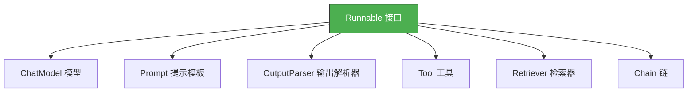
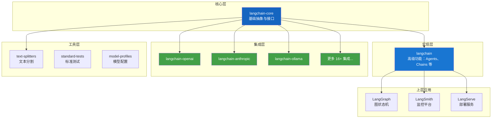

# 🚀 第一章：初识 LangChain

## 📌 本章目标

- 理解 LangChain 是什么
- 明白它要解决什么问题
- 感受 LangChain 的核心价值

---

## 1.1 LangChain 是什么？

**LangChain** 是一个用于构建 **大语言模型（LLM）应用** 的开源框架。

> 🎯 一句话总结：LangChain 就像是 LLM 世界的 **"Spring Boot"** —— 它不是大模型本身，而是帮你更高效地使用大模型来构建应用的"工具箱"。

### 生活类比 🍔

想象你要开一家汉堡店：

- **大模型（如 GPT-4、Claude）** = 厨师（核心能力：做出好吃的食物）
- **LangChain** = 厨房管理系统（帮你管理食材、菜单、订单流程、外卖对接……）

你不需要自己从头搭建所有流程，LangChain 提供了现成的"菜谱"（Chains）、"配料管理"（Prompts）、"外卖窗口"（Tools）等模块。

---

## 1.2 为什么需要 LangChain？

直接调用大模型 API 不好吗？当然可以，但随着应用变复杂，你会遇到以下痛点：

### 😰 没有 LangChain 时的痛点

```mermaid
graph TD
    A[直接调 API] --> B[痛点 1：每个模型 API 不同]
    A --> C[痛点 2：对话历史手动管理]
    A --> D[痛点 3：复杂流程难组合]
    A --> E[痛点 4：输出格式不可控]
    A --> F[痛点 5：无法让 AI 使用外部工具]
    A --> G[痛点 6：知识仅限于训练数据]

    B --> H[❌ 换模型要改一堆代码]
    C --> I[❌ 每次都要传全部历史消息]
    D --> J[❌ 回调、重试、并行……写得头大]
    E --> K[❌ AI 总是返回自由文本]
    F --> L[❌ AI 不能查数据库、调 API]
    G --> M[❌ AI 会"胡说八道"]
```

### ✅ LangChain 如何解决

| 痛点 | LangChain 方案 | 对应模块 |
|------|---------------|----------|
| API 不统一 | 统一接口抽象 | `BaseChatModel` |
| 对话历史管理 | 记忆模块 | `Memory` / `ChatMessageHistory` |
| 复杂流程 | 链式组合（LCEL） | `Runnable` / `Chain` |
| 输出不可控 | 输出解析器 | `OutputParser` |
| 无法用工具 | 工具与智能体 | `Tool` / `Agent` |
| 知识局限 | 检索增强生成 | `Retriever` / `RAG` |

---

## 1.3 一个最简单的例子

让我们看看"不用 LangChain"和"用 LangChain"的区别：

### ❌ 不用 LangChain（直接调 OpenAI API）

```python
import openai

# 手动构造请求
client = openai.OpenAI(api_key="sk-xxx")
response = client.chat.completions.create(
    model="gpt-4",
    messages=[
        {"role": "system", "content": "你是一个翻译助手"},
        {"role": "user", "content": "把'Hello World'翻译成中文"}
    ]
)
result = response.choices[0].message.content
print(result)  # "你好，世界"
```

问题：如果要换成 Claude 怎么办？得重写一堆代码。

### ✅ 用 LangChain

```python
from langchain_core.prompts import ChatPromptTemplate
from langchain_core.output_parsers import StrOutputParser
from langchain_openai import ChatOpenAI

# 定义提示模板
prompt = ChatPromptTemplate.from_messages([
    ("system", "你是一个翻译助手"),
    ("human", "把'{text}'翻译成{language}")
])

# 选择模型（换模型只需改这一行！）
model = ChatOpenAI(model="gpt-4")

# 组合成链（用管道符 | 串联）
chain = prompt | model | StrOutputParser()

# 调用
result = chain.invoke({"text": "Hello World", "language": "中文"})
print(result)  # "你好，世界"
```

> 💡 想换成 Claude？只需改一行：
> ```python
> from langchain_anthropic import ChatAnthropic
> model = ChatAnthropic(model="claude-3-sonnet-20240229")
> ```
> 其他代码**完全不需要改**！

### TypeScript 风格对照

如果你更熟悉 TypeScript，上面的逻辑大致等价于：

```typescript
// 伪代码 —— 用 TypeScript 风格理解 LangChain 的思路
interface Runnable<Input, Output> {
  invoke(input: Input): Promise<Output>;
  stream(input: Input): AsyncIterableIterator<Output>;
  batch(inputs: Input[]): Promise<Output[]>;
}

// prompt、model、parser 都实现了 Runnable 接口
const chain: Runnable = pipe(prompt, model, parser);
const result = await chain.invoke({ text: "Hello World", language: "中文" });
```

---

## 1.4 LangChain 的核心理念

### 🧩 万物皆 Runnable

LangChain 最核心的设计理念就一个字：**统一**。

无论是模型、提示模板、输出解析器、检索器还是工具，都被抽象成一个统一的 `Runnable` 接口：



> 这就像乐高积木 —— 每个组件都是标准的"接口"，可以自由拼接、组合。

### 🔗 LCEL（LangChain Expression Language）

LCEL 是 LangChain 的"管道语法"，用 `|` 符号把多个 Runnable 串联：

```python
chain = prompt | model | parser
#       ↑        ↑       ↑
#     输入加工   AI处理   输出解析
```

> 类比 Unix 管道：`cat file.txt | grep "error" | wc -l`，数据流经每个环节，层层加工。

---

## 1.5 LangChain 的生态全景

LangChain 不是一个独立的库，而是一个生态系统：



### 各层的关系

| 层级 | 包名 | 职责 |
|------|------|------|
| **核心层** | `langchain-core` | 定义所有接口和基础抽象（Runnable、Message、Tool 等） |
| **实现层** | `langchain` | 基于核心层的高级功能（Agent、Chain、Memory 等） |
| **集成层** | `langchain-openai` 等 | 具体 LLM 提供商的对接实现 |
| **工具层** | `text-splitters` 等 | 辅助工具包 |

> 💡 **为什么要分层？** 这是"依赖倒置原则"的体现 —— 上层不依赖具体实现，只依赖抽象接口。换模型、换向量数据库只需要换集成层的包，核心代码一行不改。

---

## 1.6 本教程的学习路径

```
📚 基础篇（理解核心）
  ├── 第 02 章：架构全景
  ├── 第 03 章：Runnable 核心抽象
  ├── 第 04 章：语言模型
  ├── 第 05 章：提示词工程
  ├── 第 06 章：输出解析
  └── 第 07 章：消息系统

📚 进阶篇（构建应用）
  ├── 第 08 章：链式组合
  ├── 第 09 章：文档加载
  ├── 第 10 章：文本分割
  ├── 第 11 章：嵌入与向量存储
  └── 第 12 章：RAG

📚 高级篇（生产实战）
  ├── 第 13 章：工具与智能体
  ├── 第 14 章：回调与可观测性
  ├── 第 15 章：记忆与对话
  └── 第 16 章：最佳实践
```

---

## 📌 本章小结

| 要点 | 内容 |
|------|------|
| LangChain 是什么 | LLM 应用开发框架（不是模型本身） |
| 核心理念 | 万物皆 Runnable，统一接口 |
| 核心语法 | LCEL（管道符 `\|` 串联组件） |
| 为什么需要 | 统一 API、简化开发、可组合、可观测 |
| 生态结构 | 核心层 → 实现层 → 集成层 → 工具层 |

> ⏭️ 下一章，我们将深入了解 LangChain 的 [架构全景](./02-architecture.md)，看看这个仓库是怎么组织代码的。
