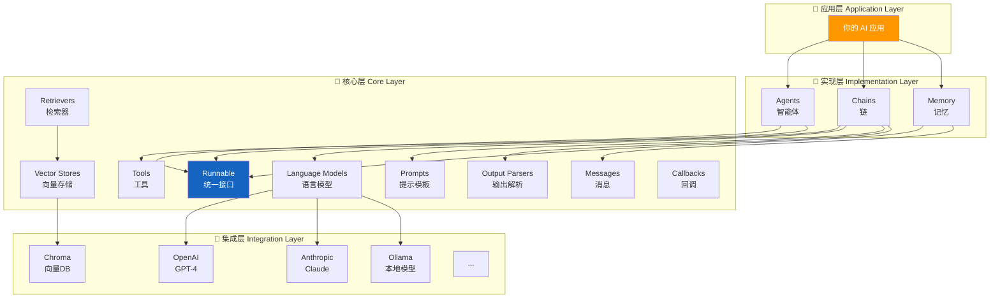
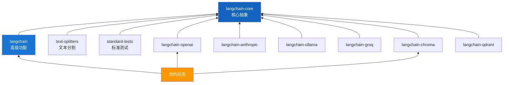
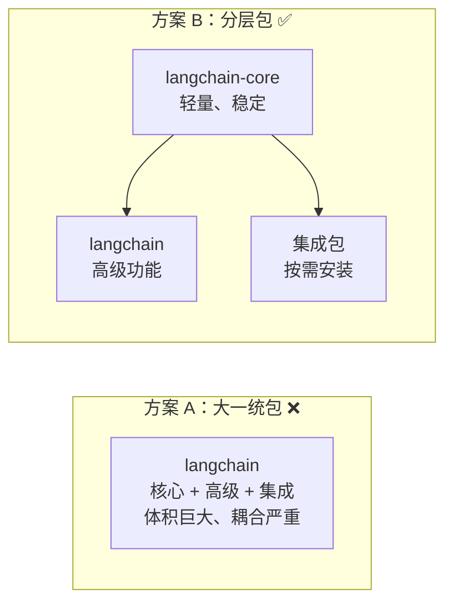

# 🏗️ 第二章：架构全景

## 📌 本章目标

- 理解 LangChain 的 Monorepo 结构
- 搞清楚各个包之间的关系
- 理解分层设计的原理

---

## 2.1 Monorepo 全景图

LangChain 采用 **Monorepo**（单体仓库）的代码组织方式，所有包都在一个仓库里，但各自独立版本发布。

> 🎓 **什么是 Monorepo？**
> 就像一个大商场里开了很多店铺 —— 所有店铺共享同一个地址（仓库），但每个店铺（包）可以独立经营（版本发布）。
> 对比 **Multirepo**：每个店铺有自己独立的地址（仓库），沟通成本更高。

### 目录结构

```
langchain/                          # 🏢 仓库根目录
├── libs/                           # 📦 所有包的集合
│   ├── core/                       # 🧱 langchain-core（核心抽象）
│   │   ├── langchain_core/         #    源代码
│   │   ├── tests/                  #    测试
│   │   └── pyproject.toml          #    包配置
│   │
│   ├── langchain/                  # 📚 langchain（高级功能）
│   │   ├── langchain_classic/      #    源代码
│   │   ├── tests/                  #    测试
│   │   └── pyproject.toml          #    包配置
│   │
│   ├── partners/                   # 🤝 第三方集成
│   │   ├── openai/                 #    OpenAI 集成
│   │   ├── anthropic/              #    Anthropic 集成
│   │   ├── ollama/                 #    Ollama 本地模型
│   │   ├── groq/                   #    Groq 推理加速
│   │   ├── huggingface/            #    HuggingFace
│   │   ├── mistral/                #    Mistral AI
│   │   ├── chroma/                 #    Chroma 向量数据库
│   │   ├── qdrant/                 #    Qdrant 向量数据库
│   │   └── ...                     #    更多 16+ 集成
│   │
│   ├── text-splitters/             # ✂️ 文本分割工具
│   ├── standard-tests/             # 🧪 标准测试套件
│   └── model-profiles/             # 📋 模型配置信息
│
├── .github/                        # 🔧 CI/CD 工作流
├── Makefile                        # 🛠️ 开发任务命令
└── README.md                       # 📖 项目说明
```

---

## 2.2 分层架构

LangChain 的设计遵循经典的 **分层架构**（Layered Architecture）：



### 为什么这样分层？

| 设计原则 | 解释 | 好处 |
|----------|------|------|
| **依赖倒置** | 上层只依赖抽象接口，不依赖具体实现 | 换模型不用改业务代码 |
| **关注点分离** | 每层只做自己该做的事 | 代码清晰、易维护 |
| **开闭原则** | 新增集成只需加新包，不改核心代码 | 扩展性强 |
| **接口隔离** | 不同功能有独立的接口 | 按需使用，不强制依赖 |

> 🔑 **核心洞察**：这就像 USB 接口标准 —— 核心层定义了"USB 口长什么样"（Runnable 接口），集成层则是各种设备（OpenAI、Claude 等）的实现。只要符合接口标准，就能即插即用。

---

## 2.3 核心包详解

### 🧱 langchain-core：基础抽象

这是整个 LangChain 生态的"地基"，定义了所有核心接口。

```
libs/core/langchain_core/
├── runnables/           # 🏃 Runnable 接口 —— 一切的起点
│   ├── base.py          #    Runnable、RunnableSequence 等
│   ├── config.py        #    运行时配置
│   ├── passthrough.py   #    数据透传
│   └── router.py        #    条件路由
│
├── language_models/     # 🤖 语言模型抽象
│   ├── chat_models.py   #    BaseChatModel（聊天模型基类）
│   ├── llms.py          #    BaseLLM（文本模型基类）
│   └── base.py          #    BaseLanguageModel（共同基类）
│
├── messages/            # 💬 消息系统
│   ├── base.py          #    BaseMessage
│   ├── human.py         #    HumanMessage（用户消息）
│   ├── ai.py            #    AIMessage（AI 回复）
│   ├── system.py        #    SystemMessage（系统提示）
│   ├── tool.py          #    ToolMessage（工具结果）
│   └── content_blocks.py #   多模态内容块
│
├── prompts/             # 📝 提示模板
│   ├── base.py          #    BasePromptTemplate
│   ├── chat.py          #    ChatPromptTemplate
│   └── prompt.py        #    PromptTemplate
│
├── output_parsers/      # 📤 输出解析器
│   ├── base.py          #    BaseOutputParser
│   ├── json.py          #    JsonOutputParser
│   ├── pydantic.py      #    PydanticOutputParser
│   └── string.py        #    StrOutputParser
│
├── documents/           # 📄 文档抽象
│   └── base.py          #    Document 类
│
├── vectorstores/        # 🗃️ 向量存储接口
│   └── base.py          #    VectorStore 基类
│
├── retrievers.py        # 🔍 检索器接口
├── tools/               # 🛠️ 工具接口
│   └── base.py          #    BaseTool
│
├── embeddings/          # 🧮 嵌入接口
│   └── embeddings.py    #    Embeddings 基类
│
├── callbacks/           # 📡 回调系统
│   ├── base.py          #    BaseCallbackHandler
│   └── manager.py       #    CallbackManager
│
├── caches.py            # 💾 缓存接口
└── chat_history.py      # 📜 对话历史
```

> 💡 **类比**：`langchain-core` 就像 Java 的 `javax.servlet` 接口 —— 只定义"规范"，不管具体实现。

### 📚 langchain：高级功能

```
libs/langchain/langchain_classic/
├── agents/              # 🤖 智能体（决策+执行循环）
│   ├── agent.py         #    Agent 基类
│   ├── agent_types.py   #    Agent 类型枚举
│   └── agent_toolkits/  #    专用工具套件（SQL、API 等）
│
├── chains/              # 🔗 预制链（Chain 模式）
│   ├── llm.py           #    LLMChain
│   ├── retrieval_qa/    #    RetrievalQA（RAG 链）
│   └── conversation/    #    对话链
│
├── memory/              # 🧠 记忆模块
│   ├── buffer.py        #    缓冲记忆
│   └── summary.py       #    摘要记忆
│
├── document_loaders/    # 📂 文档加载器
├── indexes/             # 📊 索引管理
└── evaluation/          # 📏 评估工具
```

> 💡 **类比**：`langchain` 就像 Spring Boot 的各种 Starter —— 提供了开箱即用的功能，内部调用 core 的接口。

### 🤝 集成包（Partners）

每个集成包的结构都类似：

```
libs/partners/openai/
├── langchain_openai/
│   ├── __init__.py          # 导出公共 API
│   ├── chat_models.py       # ChatOpenAI（实现 BaseChatModel）
│   ├── llms.py              # OpenAI LLM（实现 BaseLLM）
│   └── embeddings.py        # OpenAIEmbeddings（实现 Embeddings）
│
├── tests/                   # 测试
│   ├── unit_tests/          # 单元测试（不需要网络）
│   └── integration_tests/   # 集成测试（需要 API Key）
│
└── pyproject.toml           # 包配置
```

---

## 2.4 包依赖关系



### 关键依赖规则

1. **所有包都依赖 `langchain-core`**：核心层是一切的基础
2. **集成包之间互不依赖**：`langchain-openai` 和 `langchain-anthropic` 各管各的
3. **`langchain` 不强制依赖任何集成包**：按需安装
4. **你的应用选择性安装**：只装需要的集成

> 🎯 **好处**：装了 `langchain-openai` 不会把 `anthropic` 的 SDK 也装上，包体积小、不冲突。

---

## 2.5 开发工具链

LangChain 项目使用了一系列现代 Python 工具：

| 工具 | 作用 | 类比（TypeScript） |
|------|------|-------------------|
| `uv` | 包管理器和依赖解析 | `pnpm` / `bun` |
| `ruff` | 代码格式化 + Lint | `eslint` + `prettier` |
| `mypy` | 静态类型检查 | `tsc --noEmit` |
| `pytest` | 测试框架 | `jest` / `vitest` |
| `pyproject.toml` | 项目配置 | `package.json` |
| `uv.lock` | 锁文件 | `pnpm-lock.yaml` |
| `Makefile` | 任务运行器 | `npm scripts` |

### 常用开发命令

```bash
# 进入某个包目录
cd libs/core

# 安装依赖
uv sync --all-groups

# 运行测试
make test          # 等价于 npm test

# 代码检查
make lint          # 等价于 npm run lint

# 代码格式化
make format        # 等价于 npm run format

# 类型检查
uv run --group lint mypy .  # 等价于 npx tsc --noEmit
```

---

## 2.6 关键设计决策

### 为什么用 Monorepo？

| 决策 | 原因 |
|------|------|
| 统一代码标准 | 所有包共享 lint 规则、测试框架 |
| 原子性修改 | 改核心接口时可以同时更新所有集成 |
| 方便协作 | 不需要跨多个仓库提 PR |
| 共享工具 | CI/CD、标准测试套件可以复用 |

### 为什么 core 和 langchain 分离？

```
❓ 为什么不把所有代码都放在一个包里？
```



**分离的好处**：
1. **core 保持稳定**：接口不频繁变动，集成包不用总是跟着升级
2. **按需安装**：只做 RAG？装 core + 一个向量数据库集成就够了
3. **独立版本**：core v0.3 时，openai 集成可以是 v0.2
4. **降低入门门槛**：新手只需要理解 core 里的几个概念

---

## 📌 本章小结

| 要点 | 内容 |
|------|------|
| 仓库结构 | Monorepo，libs/ 下多个独立包 |
| 分层设计 | 核心层 → 实现层 → 集成层 |
| 核心包 | `langchain-core` 定义接口，`langchain` 提供高级功能 |
| 集成包 | 16+ 个 partners，各自独立 |
| 工具链 | uv + ruff + mypy + pytest |
| 设计原则 | 依赖倒置、关注点分离、开闭原则 |

> ⏭️ 下一章，我们将深入 LangChain 最核心的概念 —— [Runnable 接口与 LCEL](./03-core-runnable.md)。
