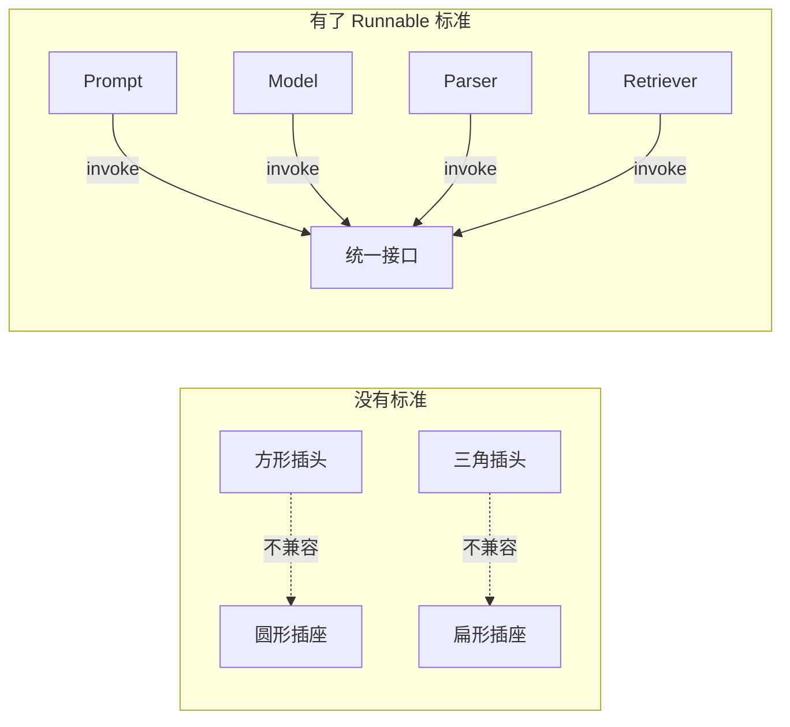
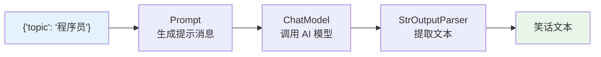
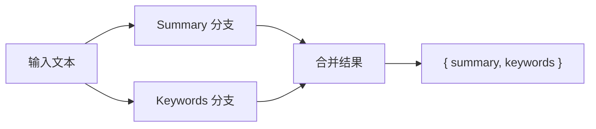
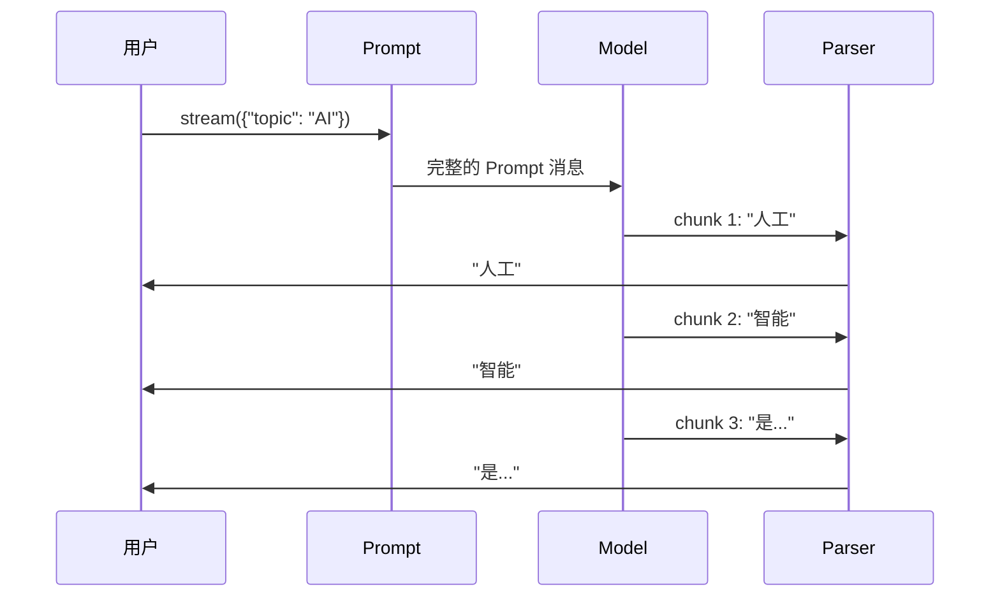
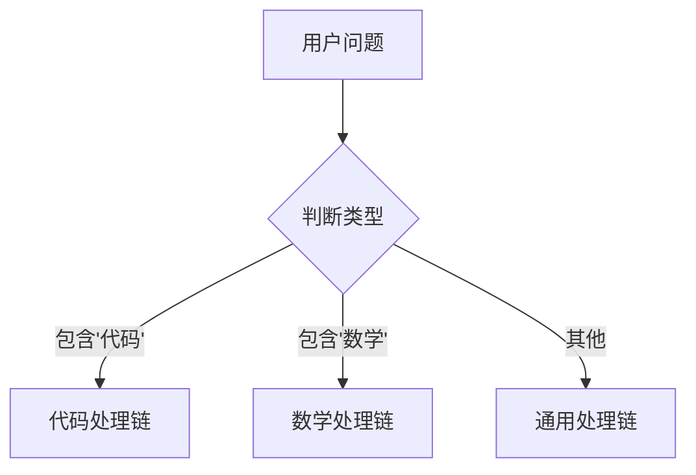
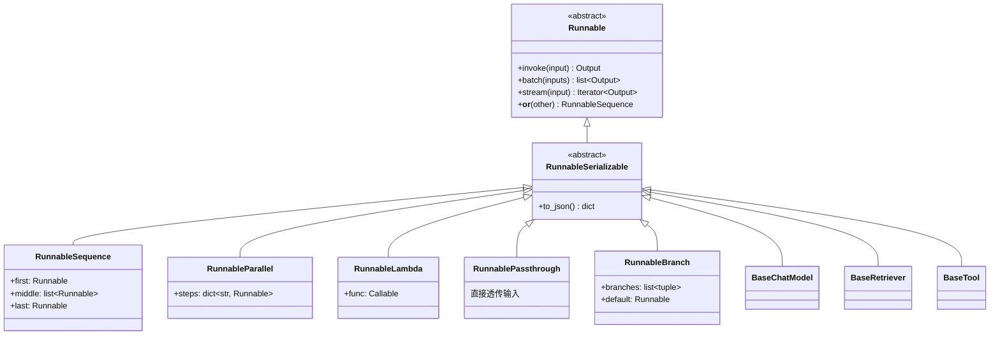

# 🧩 第三章：核心抽象 —— Runnable 与 LCEL

## 📌 本章目标

- 理解 Runnable 接口的设计哲学
- 掌握 LCEL（LangChain Expression Language）的用法
- 了解 RunnableSequence、RunnableParallel 等组合方式

---

## 3.1 为什么需要 Runnable？

### 问题场景

假设你在搭建一个 AI 应用，需要：
1. 构造 Prompt（提示模板）
2. 调用 LLM（大语言模型）
3. 解析输出（把文本变成 JSON）

如果没有统一接口，每一步的调用方式都不一样：

```python
# 😰 没有统一接口时
prompt_text = prompt_template.format(topic="AI")       # format() 方法
response = model.generate(prompt_text)                  # generate() 方法
result = parser.parse(response.text)                    # parse() 方法
```

每个组件有不同的方法名、不同的输入输出格式，组合起来很痛苦。

### Runnable 的解决方案

LangChain 定义了一个 **统一接口** `Runnable`：所有组件都实现相同的方法。

```python
# ✅ 有了 Runnable，一切组件都用同一套方法
prompt_result = prompt.invoke({"topic": "AI"})          # invoke()
model_result = model.invoke(prompt_result)              # invoke()
parsed_result = parser.invoke(model_result)             # invoke()
```

> 🎯 **核心思想**：不管组件内部多复杂，对外都暴露同一套 API —— `invoke`、`batch`、`stream`。

---

## 3.2 Runnable 接口详解

### 接口定义

Runnable 定义在 `libs/core/langchain_core/runnables/base.py` 中：

```python
# 源码路径：libs/core/langchain_core/runnables/base.py
class Runnable(Generic[Input, Output], ABC):
    """可以被调用、批量处理、流式输出的抽象单元"""
    
    def invoke(self, input: Input, config: RunnableConfig = None) -> Output:
        """同步调用，输入一个，输出一个"""
    
    async def ainvoke(self, input: Input, config: RunnableConfig = None) -> Output:
        """异步调用"""
    
    def batch(self, inputs: list[Input], config: RunnableConfig = None) -> list[Output]:
        """批量调用，输入多个，输出多个"""
    
    def stream(self, input: Input, config: RunnableConfig = None) -> Iterator[Output]:
        """流式输出，像打字机一样逐步返回结果"""
    
    async def astream(self, input: Input, config: RunnableConfig = None) -> AsyncIterator[Output]:
        """异步流式输出"""
    
    def __or__(self, other: Runnable) -> RunnableSequence:
        """管道符 | 操作，用于链式组合"""
```

### TypeScript 风格对照

```typescript
// 用 TypeScript 理解 Runnable
interface Runnable<Input, Output> {
  // 核心方法
  invoke(input: Input, config?: RunnableConfig): Promise<Output>;
  batch(inputs: Input[], config?: RunnableConfig): Promise<Output[]>;
  stream(input: Input, config?: RunnableConfig): AsyncIterable<Output>;
  
  // 管道操作（类似 RxJS 的 pipe）
  pipe<T>(next: Runnable<Output, T>): Runnable<Input, T>;
}
```

### 类比：电器插头标准 🔌



---

## 3.3 Runnable 的核心方法

### 方法一览

| 方法 | 作用 | 类比 |
|------|------|------|
| `invoke(input)` | 单次同步调用 | `fetch().then()` |
| `ainvoke(input)` | 单次异步调用 | `await fetch()` |
| `batch(inputs)` | 批量并行处理 | `Promise.all()` |
| `stream(input)` | 流式输出 | `ReadableStream` |
| `astream(input)` | 异步流式输出 | `for await...of` |

### invoke：最基础的调用

```python
from langchain_openai import ChatOpenAI
from langchain_core.messages import HumanMessage

model = ChatOpenAI(model="gpt-4")

# invoke：输入 → 处理 → 输出
result = model.invoke([HumanMessage(content="1+1=?")])
print(result.content)  # "2"
```

### batch：批量处理

```python
# 一次处理多个输入（内部自动并行）
results = model.batch([
    [HumanMessage(content="1+1=?")],
    [HumanMessage(content="2+2=?")],
    [HumanMessage(content="3+3=?")],
])
# 结果：["2", "4", "6"]
```

> 💡 `batch` 内部使用线程池并行执行，比循环调用 `invoke` 快得多。

### stream：流式输出

```python
# 像打字机一样逐步输出
for chunk in model.stream([HumanMessage(content="写一首诗")]):
    print(chunk.content, end="", flush=True)
# 输出效果：
# 春|风|拂|面|柳|丝|长|，
# 绿|水|青|山|映|斜|阳|。
```

> 💡 流式输出对用户体验至关重要 —— 用户不需要等 AI 全部生成完才看到结果。

---

## 3.4 LCEL：管道语法

### 什么是 LCEL？

**LCEL**（LangChain Expression Language）是 LangChain 的声明式组合语法，用 `|` 符号把多个 Runnable 串联起来。

```python
from langchain_core.prompts import ChatPromptTemplate
from langchain_core.output_parsers import StrOutputParser
from langchain_openai import ChatOpenAI

# 定义各组件
prompt = ChatPromptTemplate.from_template("给我讲一个关于{topic}的笑话")
model = ChatOpenAI(model="gpt-4")
parser = StrOutputParser()

# LCEL：用 | 串联
chain = prompt | model | parser

# 调用
result = chain.invoke({"topic": "程序员"})
print(result)  # "为什么程序员总是分不清万圣节和圣诞节？因为 Oct 31 = Dec 25..."
```

### 执行流程



### 类比：Unix 管道

```bash
# Unix 管道：数据流经每个命令
cat access.log | grep "ERROR" | wc -l

# LCEL 管道：数据流经每个 Runnable
chain = prompt | model | parser
```

**核心原理**：`|` 运算符内部调用了 Python 的 `__or__` 方法，返回一个 `RunnableSequence`：

```python
# prompt | model | parser 实际等价于：
chain = RunnableSequence(first=prompt, middle=[model], last=parser)
```

---

## 3.5 组合模式

### 模式一：顺序组合（RunnableSequence）

最常用的模式，数据依次流过每个步骤：

```python
# 源码路径：libs/core/langchain_core/runnables/base.py
class RunnableSequence(RunnableSerializable[Input, Output]):
    """顺序执行多个 Runnable"""
    first: Runnable      # 第一个
    middle: list[Runnable]  # 中间的
    last: Runnable       # 最后一个

chain = step1 | step2 | step3
# 等价于 RunnableSequence(first=step1, middle=[step2], last=step3)
```

### 模式二：并行组合（RunnableParallel）

多个步骤同时执行，结果合并成一个字典：

```python
from langchain_core.runnables import RunnableParallel

# 同时执行两个分析任务
analysis = RunnableParallel(
    summary=prompt_summary | model | StrOutputParser(),
    keywords=prompt_keywords | model | StrOutputParser(),
)

result = analysis.invoke({"text": "一篇长文章..."})
# result = {
#   "summary": "这篇文章讲了...",
#   "keywords": "AI, LLM, LangChain"
# }
```



> 💡 **实际应用**：需要同时做摘要、提取关键词、情感分析时，用并行组合可以大幅提升效率。

### 模式三：函数包装（RunnableLambda）

把普通 Python 函数变成 Runnable：

```python
from langchain_core.runnables import RunnableLambda

# 普通函数
def add_prefix(text: str) -> str:
    return f"[AI 回复] {text}"

# 包装成 Runnable
add_prefix_runnable = RunnableLambda(add_prefix)

# 现在可以参与管道组合了
chain = prompt | model | StrOutputParser() | add_prefix_runnable
```

### 模式四：透传（RunnablePassthrough）

让输入数据"原样透传"到下一步，常用于保留原始输入：

```python
from langchain_core.runnables import RunnablePassthrough, RunnableParallel

# 同时传递原始问题和检索结果
chain = RunnableParallel(
    question=RunnablePassthrough(),          # 原样透传问题
    context=retriever,                       # 检索相关文档
) | prompt | model | parser
```

---

## 3.6 链式组合的流式传播

LCEL 最强大的特性之一：**流式自动传播**。

当你对一个 chain 调用 `.stream()` 时，整个链路都会以流式方式工作：

```python
chain = prompt | model | StrOutputParser()

# 调用 stream，数据会逐步流过整个链
for chunk in chain.stream({"topic": "AI"}):
    print(chunk, end="")  # 逐字输出
```



> 💡 注意：Prompt 和 Parser 步骤本身不产生"流"，但它们会"透传"上游的流式数据。真正产生流式数据的是 Model。

---

## 3.7 配置系统（RunnableConfig）

每个 Runnable 调用都可以传入配置：

```python
from langchain_core.runnables import RunnableConfig

config = RunnableConfig(
    tags=["production", "v2"],       # 标签（用于过滤日志）
    metadata={"user_id": "123"},     # 元数据（传递给回调）
    callbacks=[my_callback],          # 回调处理器
    max_concurrency=5,               # 最大并发数
    run_name="translate_chain",      # 运行名称
)

result = chain.invoke({"topic": "AI"}, config=config)
```

### TypeScript 风格对照

```typescript
interface RunnableConfig {
  tags?: string[];
  metadata?: Record<string, any>;
  callbacks?: BaseCallbackHandler[];
  maxConcurrency?: number;
  runName?: string;
  configurable?: Record<string, any>;
}

const result = await chain.invoke({ topic: "AI" }, {
  tags: ["production"],
  metadata: { userId: "123" },
});
```

---

## 3.8 高级组合技巧

### 条件路由（RunnableBranch）

根据条件选择不同的执行路径：

```python
from langchain_core.runnables import RunnableBranch

# 根据问题类型选择不同的处理链
branch = RunnableBranch(
    (lambda x: "代码" in x["question"], code_chain),      # 代码问题
    (lambda x: "数学" in x["question"], math_chain),      # 数学问题
    general_chain,                                         # 默认链
)

result = branch.invoke({"question": "写一段 Python 代码"})
# → 走 code_chain
```



### 重试与容错

```python
# 自动重试（网络错误、API 限流）
chain_with_retry = chain.with_retry(
    stop_after_attempt=3,     # 最多重试 3 次
    wait_exponential_jitter=True  # 指数退避 + 随机抖动
)

# 备用模型（主模型失败时自动切换）
chain_with_fallback = primary_model.with_fallbacks([
    fallback_model_1,
    fallback_model_2,
])
```

### 绑定参数

```python
# 给模型预设参数
model_with_temp = model.bind(temperature=0)  # 固定温度为 0

# 给模型绑定工具
model_with_tools = model.bind_tools([search_tool, calc_tool])
```

---

## 3.9 Runnable 家族一览



---

## 📌 本章小结

| 要点 | 内容 |
|------|------|
| Runnable 是什么 | 统一接口：invoke / batch / stream |
| LCEL 是什么 | 用 `\|` 管道符组合 Runnable 的语法 |
| 组合模式 | 顺序、并行、函数、透传、条件分支 |
| 流式传播 | stream 会自动沿着链路传播 |
| 配置系统 | RunnableConfig 控制标签、回调、并发 |
| 容错机制 | with_retry + with_fallbacks |

> 🔑 **记住这个核心公式**：
> ```
> 在 LangChain 中，一切皆 Runnable，
> Runnable 可以通过 | 组合成更大的 Runnable。
> ```

> ⏭️ 下一章，我们将学习 LangChain 中最重要的 Runnable 之一 —— [语言模型（Models）](./04-models.md)。
