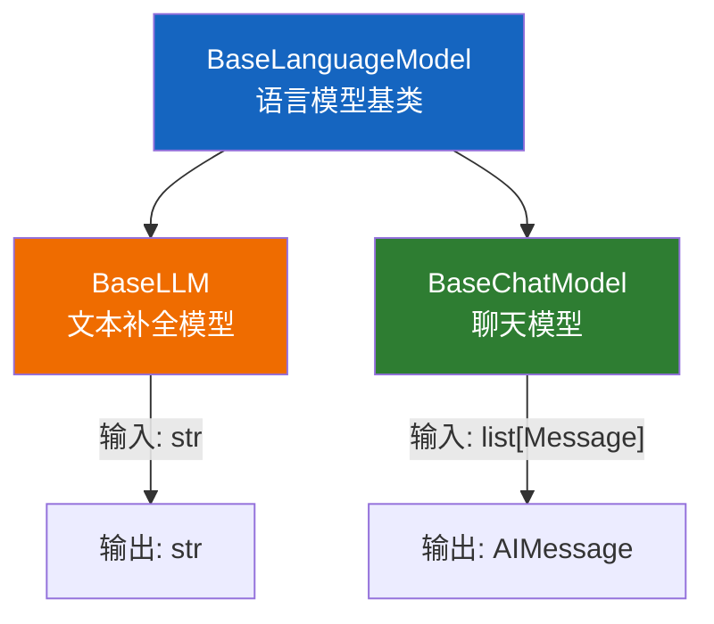
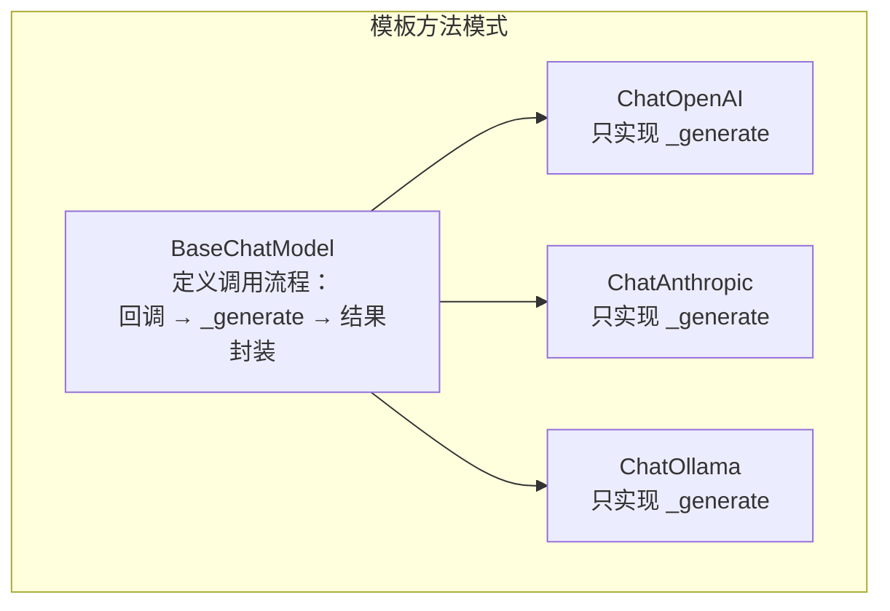
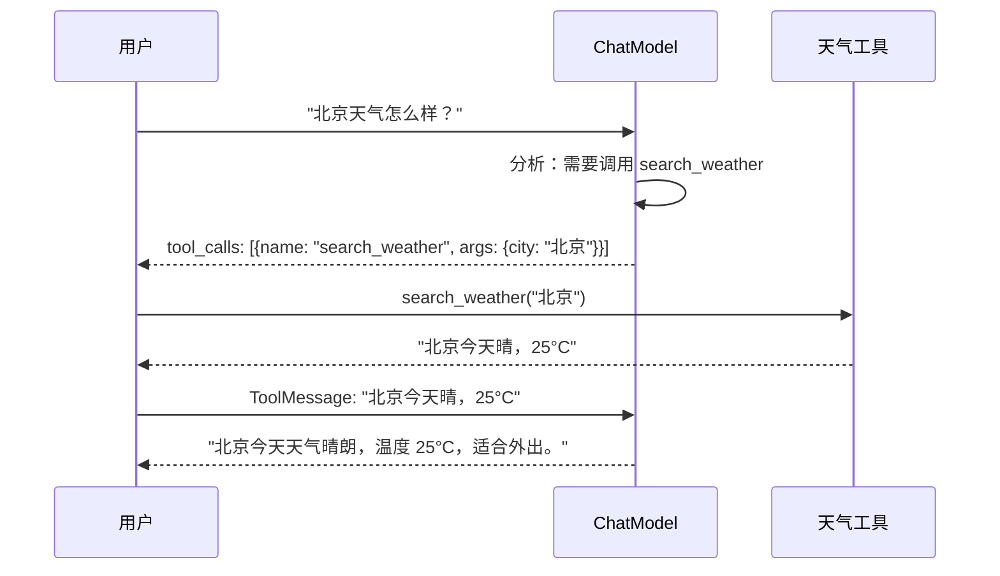
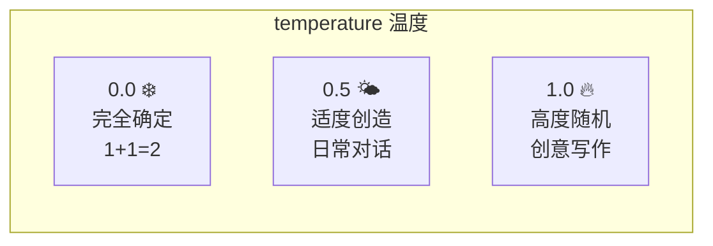

# 🤖 第四章：语言模型（Models）

## 📌 本章目标

- 理解 LLM 和 ChatModel 的区别
- 掌握 BaseChatModel 的接口设计
- 了解结构化输出、Tool Calling 等高级特性
- 理解集成层如何实现核心接口

---

## 4.1 两种模型类型

LangChain 将语言模型分为两大类：



| 类型 | 输入 | 输出 | 典型模型 | 是否推荐 |
|------|------|------|----------|----------|
| **BaseLLM** | 纯文本 `str` | 纯文本 `str` | GPT-3 (text-davinci) | ⚠️ 逐渐淘汰 |
| **BaseChatModel** | 消息列表 `list[Message]` | AI 消息 `AIMessage` | GPT-4, Claude, Llama | ✅ 推荐使用 |

> 💡 **现实情况**：几乎所有现代 LLM 都使用 Chat 接口（消息列表格式），BaseLLM 是历史遗留。新项目请直接用 BaseChatModel。

### 类比 💬

- **BaseLLM** 像 **短信** —— 你发一段文字，它回一段文字
- **BaseChatModel** 像 **微信聊天** —— 有角色区分（你、AI、系统），有上下文

---

## 4.2 BaseChatModel 深入

### 接口定义

```python
# 源码路径：libs/core/langchain_core/language_models/chat_models.py
class BaseChatModel(BaseLanguageModel[BaseMessage], ABC):
    """聊天模型的基类 —— 输入消息列表，输出 AI 消息"""

    @abstractmethod
    def _generate(
        self,
        messages: list[BaseMessage],
        stop: list[str] | None = None,
        run_manager: CallbackManagerForLLMRun | None = None,
        **kwargs,
    ) -> ChatResult:
        """核心实现方法（子类必须实现）"""

    # 以下方法已由基类实现，子类不需要重写：
    def invoke(self, input, config=None) -> AIMessage: ...
    def stream(self, input, config=None) -> Iterator[AIMessageChunk]: ...
    def batch(self, inputs, config=None) -> list[AIMessage]: ...
    async def ainvoke(self, input, config=None) -> AIMessage: ...
```

> 🔑 **关键设计**：子类只需实现 `_generate` 一个方法，就自动获得 `invoke`、`stream`、`batch`、`ainvoke` 等全套能力。这就是 **模板方法模式（Template Method Pattern）** 的经典应用。

### 为什么这样设计？



**好处**：
1. 集成开发者只关注"怎么调 API"，不需要管回调、重试、日志等
2. 所有模型的行为一致，用户切换模型零成本
3. 新功能（如 `with_structured_output`）加在基类，所有子类自动获得

---

## 4.3 具体集成示例：ChatOpenAI

来看看一个具体的模型集成是如何实现的：

```python
# 源码路径：libs/partners/openai/langchain_openai/chat_models/base.py
class BaseChatOpenAI(BaseChatModel):
    """OpenAI 聊天模型的实现"""
    
    model_name: str = "gpt-4o-mini"       # 模型名称
    temperature: float = 0.7               # 温度（随机性）
    max_tokens: int | None = None          # 最大生成 token 数
    openai_api_key: str | None = None      # API 密钥
    
    def _generate(self, messages, stop=None, **kwargs):
        """调用 OpenAI API"""
        # 1. 把 LangChain 的 Message 转换为 OpenAI 格式
        openai_messages = [convert_to_openai(m) for m in messages]
        
        # 2. 调用 OpenAI SDK
        response = self.client.chat.completions.create(
            model=self.model_name,
            messages=openai_messages,
            temperature=self.temperature,
            **kwargs
        )
        
        # 3. 把 OpenAI 的响应转换回 LangChain 格式
        return ChatResult(generations=[
            ChatGeneration(message=AIMessage(content=response.choices[0].message.content))
        ])
```

### 使用方式

```python
from langchain_openai import ChatOpenAI
from langchain_core.messages import HumanMessage, SystemMessage

# 创建模型实例
model = ChatOpenAI(
    model="gpt-4",
    temperature=0,        # 0=确定性输出，1=更随机
    max_tokens=1000,
)

# 调用
response = model.invoke([
    SystemMessage(content="你是一个 Python 专家"),
    HumanMessage(content="解释什么是装饰器"),
])

print(response.content)    # AI 的回复文本
print(response.usage_metadata)  # token 使用量
```

---

## 4.4 关键特性

### 特性一：结构化输出（Structured Output）

让 AI 返回符合你定义的数据结构，而不是自由文本：

```python
from pydantic import BaseModel

# 定义输出结构
class MovieReview(BaseModel):
    title: str          # 电影名
    rating: float       # 评分 (0-10)
    summary: str        # 一句话总结
    recommend: bool     # 是否推荐

# 绑定结构化输出
structured_model = model.with_structured_output(MovieReview)

# 调用 —— 返回的直接是 MovieReview 对象！
review = structured_model.invoke("评价一下电影《盗梦空间》")
print(review.title)      # "盗梦空间"
print(review.rating)     # 9.2
print(review.recommend)  # True
```

> 💡 **原理**：`with_structured_output` 内部会：
> 1. 把 Pydantic Schema 转换为 JSON Schema
> 2. 通过模型的 Function Calling / Tool Use 能力约束输出
> 3. 把返回的 JSON 解析为 Pydantic 对象

### 特性二：工具调用（Tool Calling）

让模型可以"调用工具"（如搜索、计算器）：

```python
from langchain_core.tools import tool

@tool
def search_weather(city: str) -> str:
    """查询城市的天气"""
    return f"{city}今天晴，25°C"

@tool
def calculate(expression: str) -> str:
    """计算数学表达式"""
    return str(eval(expression))

# 给模型绑定工具
model_with_tools = model.bind_tools([search_weather, calculate])

# 模型会根据问题决定是否调用工具
response = model_with_tools.invoke("北京今天天气怎么样？")
print(response.tool_calls)
# [{'name': 'search_weather', 'args': {'city': '北京'}, 'id': 'call_xxx'}]
```



### 特性三：流式输出（Streaming）

```python
# 流式输出 —— 逐步返回结果
for chunk in model.stream([HumanMessage(content="写一首关于春天的诗")]):
    print(chunk.content, end="", flush=True)
    # 每个 chunk 是一个 AIMessageChunk，包含部分文本
```

### 特性四：容错策略

```python
from langchain_anthropic import ChatAnthropic

# 主模型 + 备用模型
primary = ChatOpenAI(model="gpt-4")
fallback = ChatAnthropic(model="claude-3-sonnet-20240229")

# 如果 GPT-4 调用失败，自动切换到 Claude
safe_model = primary.with_fallbacks([fallback])

# 自动重试
retry_model = primary.with_retry(
    stop_after_attempt=3,                # 最多重试 3 次
    wait_exponential_jitter=True,        # 指数退避
)
```

---

## 4.5 模型切换：一行代码

LangChain 最大的价值之一就是模型切换的便捷性：

```python
# 只需要改这一行，其他代码完全不变！
# model = ChatOpenAI(model="gpt-4")               # OpenAI
# model = ChatAnthropic(model="claude-3-opus")     # Anthropic
# model = ChatOllama(model="llama3")               # 本地 Ollama
# model = ChatGroq(model="llama-3.3-70b")          # Groq
# model = ChatMistralAI(model="mistral-large")     # Mistral

chain = prompt | model | parser  # 其他代码一字不改
```

### TypeScript 风格类比

```typescript
// 这就像 TypeScript 中面向接口编程
interface ChatModel {
  invoke(messages: Message[]): Promise<AIMessage>;
}

// 不同实现，但接口一致
const model: ChatModel = new ChatOpenAI({ model: "gpt-4" });
// const model: ChatModel = new ChatAnthropic({ model: "claude-3" });

// 业务代码只依赖接口，不依赖具体实现
const chain = pipe(prompt, model, parser);
```

---

## 4.6 模型参数配置

### 常见参数

```python
model = ChatOpenAI(
    model="gpt-4",               # 模型名称
    temperature=0.7,             # 温度：0=确定性，1=创造性
    max_tokens=2000,             # 最大生成 token 数
    top_p=0.9,                   # nucleus sampling
    frequency_penalty=0.5,       # 频率惩罚（减少重复）
    presence_penalty=0.5,        # 存在惩罚（鼓励新话题）
    timeout=30,                  # 超时（秒）
    max_retries=2,               # 最大重试次数
)
```

### 参数含义图解



> 💡 **经验法则**：
> - 代码生成 / 数据提取 → `temperature=0`
> - 日常对话 → `temperature=0.5-0.7`
> - 创意写作 / 头脑风暴 → `temperature=0.8-1.0`

---

## 4.7 集成包的发现与安装

在这个仓库中，所有官方集成包位于 `libs/partners/` 目录：

```bash
ls libs/partners/
# anthropic/  chroma/  deepseek/  exa/  fireworks/  groq/  
# huggingface/  mistral/  nomic/  ollama/  openai/  openrouter/  
# perplexity/  qdrant/  xai/
```

安装某个集成：

```bash
pip install langchain-openai      # OpenAI
pip install langchain-anthropic   # Claude
pip install langchain-ollama      # 本地模型
pip install langchain-chroma      # Chroma 向量数据库
```

---

## 📌 本章小结

| 要点 | 内容 |
|------|------|
| 两种模型 | BaseLLM（文本→文本）和 BaseChatModel（消息→消息） |
| 推荐使用 | BaseChatModel，现代 LLM 的标准接口 |
| 设计模式 | 模板方法模式 —— 子类只需实现 `_generate` |
| 核心特性 | 结构化输出、Tool Calling、流式、容错 |
| 切换模型 | 只需更换模型实例，其他代码不变 |
| 集成安装 | `pip install langchain-{provider}` |

> ⏭️ 下一章，我们将学习如何用 [提示模板（Prompts）](./05-prompts.md) 来构造高质量的输入。
