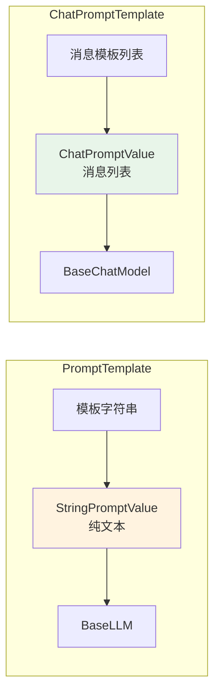
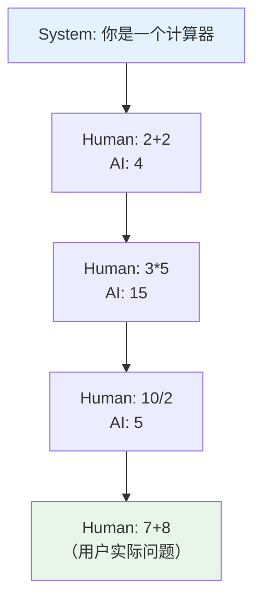

# 📝 第五章：提示词工程（Prompts）

## 📌 本章目标

- 理解 Prompt Template 的作用和设计原理
- 掌握 PromptTemplate 和 ChatPromptTemplate 的使用
- 学会 Few-shot Prompting 和 动态模板技巧

---

## 5.1 为什么需要 Prompt 模板？

### 问题场景

不用模板时，构造 Prompt 是这样的：

```python
# 😰 硬编码 + 字符串拼接
topic = "人工智能"
language = "中文"
prompt = f"你是一个翻译专家。请将以下内容翻译成{language}：\n\n{topic}"
```

**痛点**：
- 模板和变量混在一起，难以管理
- 无法复用、测试和版本控制
- 多步骤链时，变量传递很混乱

### Prompt Template 的解决方案

```python
# ✅ 模板与变量分离
from langchain_core.prompts import PromptTemplate

template = PromptTemplate.from_template(
    "你是一个翻译专家。请将以下内容翻译成{language}：\n\n{text}"
)

# 使用时传入变量
result = template.invoke({"language": "中文", "text": "Hello World"})
```

> 💡 就像 HTML 模板引擎（如 Handlebars、EJS）—— 模板定义结构，变量填充内容。

---

## 5.2 两种核心模板

### PromptTemplate：纯文本模板

```python
# 源码路径：libs/core/langchain_core/prompts/prompt.py

from langchain_core.prompts import PromptTemplate

# 方式一：from_template（自动检测变量）
template = PromptTemplate.from_template(
    "给我讲一个关于{topic}的{style}笑话"
)
print(template.input_variables)  # ['topic', 'style']

# 方式二：手动指定变量
template = PromptTemplate(
    input_variables=["topic", "style"],
    template="给我讲一个关于{topic}的{style}笑话"
)

# 调用（因为是 Runnable，用 invoke）
result = template.invoke({"topic": "程序员", "style": "冷"})
print(result)  # StringPromptValue("给我讲一个关于程序员的冷笑话")
```

### ChatPromptTemplate：聊天消息模板 ⭐

这是更常用的模板，生成的是消息列表（适配 ChatModel）：

```python
# 源码路径：libs/core/langchain_core/prompts/chat.py

from langchain_core.prompts import ChatPromptTemplate

# 方式一：from_messages（推荐）
prompt = ChatPromptTemplate.from_messages([
    ("system", "你是一个{role}，请用{language}回答问题"),
    ("human", "{question}"),
])

# 方式二：使用 Message 对象
from langchain_core.prompts import SystemMessagePromptTemplate, HumanMessagePromptTemplate

prompt = ChatPromptTemplate.from_messages([
    SystemMessagePromptTemplate.from_template("你是一个{role}"),
    HumanMessagePromptTemplate.from_template("{question}"),
])

# 调用
messages = prompt.invoke({
    "role": "Python 专家",
    "language": "中文", 
    "question": "什么是装饰器？"
})
# 输出消息列表：
# [
#   SystemMessage(content="你是一个Python专家，请用中文回答问题"),
#   HumanMessage(content="什么是装饰器？")
# ]
```

### 两种模板的区别



> 💡 **经验法则**：绝大多数场景用 `ChatPromptTemplate`，因为现代 LLM 都是 Chat 接口。

---

## 5.3 消息角色

ChatPromptTemplate 支持多种消息角色：

```python
prompt = ChatPromptTemplate.from_messages([
    # 系统消息：设定 AI 的身份和行为规范
    ("system", "你是一个资深的代码审查专家，请严格检查代码质量"),
    
    # 用户消息：用户的输入
    ("human", "请审查以下代码：\n{code}"),
    
    # AI 消息（可选）：预设 AI 的开场白
    ("ai", "好的，我来仔细审查这段代码。"),
    
    # 占位符：动态插入历史消息
    ("placeholder", "{chat_history}"),
    
    # 用户消息：后续输入
    ("human", "{followup_question}"),
])
```

| 角色 | 元组格式 | 说明 |
|------|----------|------|
| System | `("system", "...")` | 设定 AI 行为规范 |
| Human | `("human", "...")` | 用户输入 |
| AI | `("ai", "...")` | AI 回复（Few-shot 时常用） |
| Placeholder | `("placeholder", "{var}")` | 动态插入消息列表 |

---

## 5.4 Few-shot Prompting（少样本提示）

通过给 AI 几个示例，教它按照特定格式回答：

### 基本用法

```python
prompt = ChatPromptTemplate.from_messages([
    ("system", "你是一个情感分析助手，请分析文本的情感倾向"),
    
    # 示例 1（正面）
    ("human", "这个产品太好用了，强烈推荐！"),
    ("ai", '{{"sentiment": "正面", "score": 0.95, "keywords": ["好用", "推荐"]}}'),
    
    # 示例 2（负面）
    ("human", "质量太差了，用了一天就坏了"),
    ("ai", '{{"sentiment": "负面", "score": 0.85, "keywords": ["差", "坏"]}}'),
    
    # 实际问题
    ("human", "{text}"),
])

chain = prompt | model | StrOutputParser()
result = chain.invoke({"text": "还行吧，中规中矩"})
# {"sentiment": "中性", "score": 0.50, "keywords": ["还行", "中规中矩"]}
```

### 动态 Few-shot（从示例库中选择）

```python
from langchain_core.prompts import FewShotChatMessagePromptTemplate

# 示例库
examples = [
    {"input": "2+2", "output": "4"},
    {"input": "3*5", "output": "15"},
    {"input": "10/2", "output": "5"},
]

# 示例模板
example_prompt = ChatPromptTemplate.from_messages([
    ("human", "{input}"),
    ("ai", "{output}"),
])

# Few-shot 模板
few_shot_prompt = FewShotChatMessagePromptTemplate(
    example_prompt=example_prompt,
    examples=examples,
)

# 完整 Prompt
final_prompt = ChatPromptTemplate.from_messages([
    ("system", "你是一个计算器"),
    few_shot_prompt,
    ("human", "{input}"),
])
```



---

## 5.5 模板变量的高级用法

### 部分填充（Partial）

预先填入部分变量：

```python
prompt = ChatPromptTemplate.from_messages([
    ("system", "当前日期：{date}"),
    ("human", "{question}"),
])

# 部分填充 date 变量
prompt_with_date = prompt.partial(date="2024-01-15")

# 后续使用只需传 question
result = prompt_with_date.invoke({"question": "今天天气如何？"})
```

### 使用函数动态生成变量

```python
from datetime import datetime

# 用函数动态生成日期
prompt = ChatPromptTemplate.from_messages([
    ("system", "当前时间：{current_time}"),
    ("human", "{question}"),
]).partial(current_time=lambda: datetime.now().strftime("%Y-%m-%d %H:%M"))
```

---

## 5.6 在 LCEL 中使用 Prompt

Prompt 是 Runnable，可以直接参与管道组合：

```python
from langchain_core.prompts import ChatPromptTemplate
from langchain_core.output_parsers import StrOutputParser
from langchain_openai import ChatOpenAI

# 翻译链
translate_chain = (
    ChatPromptTemplate.from_messages([
        ("system", "你是一个翻译专家"),
        ("human", "把'{text}'翻译成{target_language}"),
    ])
    | ChatOpenAI(model="gpt-4", temperature=0)
    | StrOutputParser()
)

# 使用
result = translate_chain.invoke({
    "text": "Hello World",
    "target_language": "日语"
})
# "こんにちは世界"
```

### 更复杂的例子：多步骤链

```python
from langchain_core.runnables import RunnablePassthrough

# 第一步：生成代码
code_prompt = ChatPromptTemplate.from_messages([
    ("system", "你是 Python 专家，只输出代码，不要解释"),
    ("human", "写一个{description}的函数"),
])

# 第二步：代码审查
review_prompt = ChatPromptTemplate.from_messages([
    ("system", "你是代码审查专家"),
    ("human", "请审查以下代码并给出改进建议：\n\n{code}"),
])

model = ChatOpenAI(model="gpt-4")

# 组合链
chain = (
    code_prompt
    | model
    | StrOutputParser()
    | (lambda code: {"code": code})  # 把输出包装为字典
    | review_prompt
    | model
    | StrOutputParser()
)

result = chain.invoke({"description": "快速排序"})
```

---

## 5.7 Prompt 设计最佳实践

### 原则一：明确角色 🎭

```python
# ❌ 模糊
prompt = ChatPromptTemplate.from_messages([
    ("system", "帮我回答问题"),
    ("human", "{question}"),
])

# ✅ 明确
prompt = ChatPromptTemplate.from_messages([
    ("system", "你是一位资深的 Python 后端工程师，擅长 Django 和 FastAPI。"
               "请用简洁的中文回答问题，必要时附带代码示例。"),
    ("human", "{question}"),
])
```

### 原则二：给出格式要求 📋

```python
prompt = ChatPromptTemplate.from_messages([
    ("system", """你是一个代码分析助手。请按以下 JSON 格式回答：
{{
  "language": "编程语言",
  "complexity": "low/medium/high",
  "issues": ["问题1", "问题2"],
  "suggestions": ["建议1", "建议2"]
}}"""),
    ("human", "分析这段代码：\n{code}"),
])
```

### 原则三：拆分复杂任务 🔧

```python
# ❌ 一个超长的 Prompt 做所有事
# ✅ 拆分成多个步骤

step1 = ChatPromptTemplate.from_messages([
    ("system", "提取文章的关键信息"),
    ("human", "{article}"),
])

step2 = ChatPromptTemplate.from_messages([
    ("system", "基于关键信息生成摘要"),
    ("human", "{key_info}"),
])

# 用 LCEL 组合
chain = step1 | model | parser | step2 | model | parser
```

---

## 📌 本章小结

| 要点 | 内容 |
|------|------|
| PromptTemplate | 纯文本模板，适合 BaseLLM |
| ChatPromptTemplate | 消息列表模板，适合 BaseChatModel（推荐） |
| 消息角色 | system / human / ai / placeholder |
| Few-shot | 给 AI 示例来引导输出格式 |
| Partial | 预填充部分变量 |
| 最佳实践 | 明确角色、给格式、拆分任务 |

> ⏭️ 下一章，我们将学习如何用 [输出解析器（Output Parsers）](./06-output-parsers.md) 把 AI 的"自由文本"变成结构化数据。
