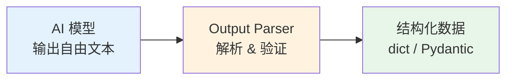
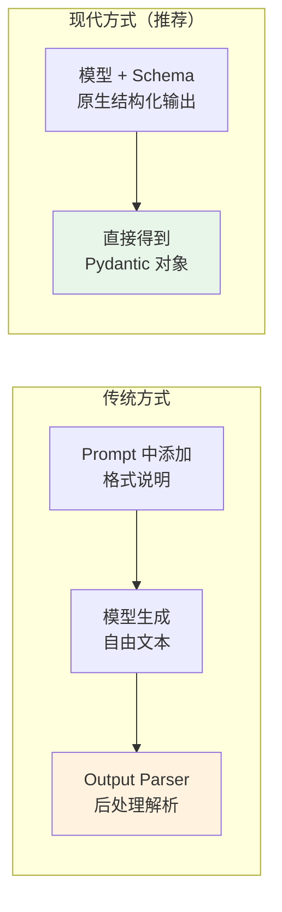

# 📤 第六章：输出解析（Output Parsers）

## 📌 本章目标

- 理解 Output Parser 的设计目的
- 掌握常用解析器：StrOutputParser、JsonOutputParser、PydanticOutputParser
- 了解 `with_structured_output` 的现代替代方案

---

## 6.1 为什么需要输出解析？

LLM 的输出是"自由文本" —— 它可以回答任何格式的内容。但在程序中，我们需要**结构化数据**。

### 问题场景

```python
# AI 的原始输出（自由文本，格式不可控）
"""
电影名称：盗梦空间
评分：9.3分
推荐：是的，非常推荐这部电影！
关键词：科幻、梦境、心理
"""

# 我们需要的（结构化数据）
{
    "title": "盗梦空间",
    "rating": 9.3,
    "recommend": True,
    "keywords": ["科幻", "梦境", "心理"]
}
```

### 类比 🏭

> Output Parser 就像工厂的"质检流水线" —— 原材料（AI 文本）进来，合格产品（结构化数据）出去。



---

## 6.2 基础接口

```python
# 源码路径：libs/core/langchain_core/output_parsers/base.py
class BaseOutputParser(Runnable[str | BaseMessage, T], ABC):
    """输出解析器基类"""
    
    @abstractmethod
    def parse(self, text: str) -> T:
        """解析文本为目标类型"""
    
    def get_format_instructions(self) -> str:
        """返回格式说明（可插入 Prompt 中）"""
```

> 🔑 **关键设计**：Output Parser 也是 Runnable！所以可以直接用 `|` 接在 Model 后面。

---

## 6.3 常用解析器

### StrOutputParser：最简单的解析器

只做一件事 —— 把 `AIMessage` 转换成纯字符串：

```python
from langchain_core.output_parsers import StrOutputParser

parser = StrOutputParser()

# 把 AIMessage 的 content 提取出来
chain = prompt | model | parser
result = chain.invoke({"topic": "AI"})
print(type(result))  # <class 'str'>
print(result)         # "人工智能是..."
```

> 💡 几乎所有链都会用到 `StrOutputParser`，因为我们通常关心的是文本内容本身。

### JsonOutputParser：提取 JSON

```python
from langchain_core.output_parsers import JsonOutputParser

parser = JsonOutputParser()

prompt = ChatPromptTemplate.from_messages([
    ("system", "请以 JSON 格式回答问题。{format_instructions}"),
    ("human", "{question}"),
]).partial(format_instructions=parser.get_format_instructions())

chain = prompt | model | parser

result = chain.invoke({"question": "给出 3 个 Python 常用库及其用途"})
# result = [
#   {"name": "requests", "purpose": "HTTP 请求"},
#   {"name": "pandas", "purpose": "数据分析"},
#   {"name": "flask", "purpose": "Web 框架"}
# ]
```

### PydanticOutputParser：类型安全的解析 ⭐

```python
from langchain_core.output_parsers import PydanticOutputParser
from pydantic import BaseModel, Field

# 定义目标数据结构
class Recipe(BaseModel):
    """食谱"""
    name: str = Field(description="菜名")
    ingredients: list[str] = Field(description="所需食材")
    steps: list[str] = Field(description="烹饪步骤")
    cooking_time: int = Field(description="烹饪时间（分钟）")
    difficulty: str = Field(description="难度：简单/中等/困难")

# 创建解析器
parser = PydanticOutputParser(pydantic_object=Recipe)

prompt = ChatPromptTemplate.from_messages([
    ("system", "你是一个厨师。请按以下格式输出食谱：\n{format_instructions}"),
    ("human", "教我做{dish}"),
]).partial(format_instructions=parser.get_format_instructions())

chain = prompt | model | parser

# 返回的是 Recipe 对象！
recipe = chain.invoke({"dish": "宫保鸡丁"})
print(recipe.name)            # "宫保鸡丁"
print(recipe.ingredients)     # ["鸡胸肉", "花生", "干辣椒", ...]
print(recipe.cooking_time)    # 30
print(type(recipe))           # <class 'Recipe'>
```

> 💡 **Pydantic** 是 Python 的数据验证库（类似 TypeScript 的 Zod）。它确保 AI 的输出严格匹配你定义的数据结构。

### TypeScript 风格对照

```typescript
// TypeScript 中类似 Pydantic 的是 Zod
import { z } from 'zod';

const RecipeSchema = z.object({
  name: z.string(),
  ingredients: z.array(z.string()),
  steps: z.array(z.string()),
  cooking_time: z.number(),
  difficulty: z.enum(['简单', '中等', '困难']),
});

type Recipe = z.infer<typeof RecipeSchema>;
// 然后用 schema 去验证 AI 的输出
```

---

## 6.4 流式解析

Output Parser 也支持流式处理！尤其是 `JsonOutputParser`：

```python
from langchain_core.output_parsers import JsonOutputParser

chain = prompt | model | JsonOutputParser()

# 流式解析 JSON —— 逐步返回部分解析结果
for partial in chain.stream({"question": "列出 3 种水果"}):
    print(partial)
    # 第一次：{}
    # 第二次：{"fruits": []}
    # 第三次：{"fruits": [{"name": "苹果"}]}
    # 第四次：{"fruits": [{"name": "苹果"}, {"name": "香蕉"}]}
    # ...
```

> 💡 这对于 UI 展示特别有用 —— 可以在 JSON 还没完全生成时就开始展示部分数据。

---

## 6.5 现代替代方案：with_structured_output ⭐

从 LangChain 0.2 开始，更推荐使用模型内置的 `with_structured_output` 方法，它比 Output Parser 更可靠：

```python
from pydantic import BaseModel
from langchain_openai import ChatOpenAI

class MovieReview(BaseModel):
    """电影评价"""
    title: str
    rating: float
    summary: str
    recommend: bool

model = ChatOpenAI(model="gpt-4")

# 直接让模型输出结构化数据（不需要 Output Parser）
structured_model = model.with_structured_output(MovieReview)

review = structured_model.invoke("评价电影《星际穿越》")
print(review.title)      # "星际穿越"
print(review.rating)     # 9.5
print(review.recommend)  # True
```

### with_structured_output vs Output Parser

| 对比项 | Output Parser | with_structured_output |
|--------|---------------|----------------------|
| 工作原理 | Prompt 中添加格式说明 + 后处理解析 | 利用模型原生的结构化输出能力 |
| 可靠性 | 中等（AI 可能不遵循格式） | 高（模型层面保证格式） |
| 适用范围 | 所有模型 | 支持 Tool Calling 的模型 |
| 推荐程度 | 兼容方案 | ⭐ 推荐使用 |



---

## 6.6 自定义 Output Parser

当内置解析器不满足需求时，可以自定义：

```python
from langchain_core.output_parsers import BaseOutputParser

class CommaSeparatedListOutputParser(BaseOutputParser[list[str]]):
    """把逗号分隔的文本解析为列表"""
    
    def parse(self, text: str) -> list[str]:
        """核心解析逻辑"""
        return [item.strip() for item in text.split(",")]
    
    def get_format_instructions(self) -> str:
        return "请以逗号分隔的形式列出答案，例如：item1, item2, item3"

# 使用
parser = CommaSeparatedListOutputParser()

prompt = ChatPromptTemplate.from_template(
    "列出 5 种{category}。{format_instructions}"
).partial(format_instructions=parser.get_format_instructions())

chain = prompt | model | parser
result = chain.invoke({"category": "编程语言"})
# ["Python", "JavaScript", "TypeScript", "Go", "Rust"]
```

---

## 6.7 错误处理

解析失败时的处理策略：

```python
from langchain_core.output_parsers import PydanticOutputParser
from langchain_core.exceptions import OutputParserException

parser = PydanticOutputParser(pydantic_object=Recipe)

try:
    result = parser.parse("这不是一个合法的 JSON")
except OutputParserException as e:
    print(f"解析失败：{e}")
    # 可以选择：
    # 1. 重试（让 AI 重新生成）
    # 2. 使用默认值
    # 3. 让 AI 修正输出
```

### 自动修正（Auto-fix）

```python
from langchain.output_parsers import RetryOutputParser

# 解析失败时自动让 AI 修正
retry_parser = RetryOutputParser.from_llm(
    parser=parser,
    llm=model,
    max_retries=3,
)
```

---

## 📌 本章小结

| 要点 | 内容 |
|------|------|
| Output Parser 的作用 | 把 AI 自由文本转换为结构化数据 |
| StrOutputParser | 最简单 —— 提取纯文本 |
| JsonOutputParser | 提取 JSON，支持流式 |
| PydanticOutputParser | 类型安全，验证数据结构 |
| with_structured_output | 现代推荐方案，模型原生结构化输出 |
| 自定义解析器 | 继承 BaseOutputParser，实现 parse 方法 |

> ⏭️ 下一章，我们将深入了解 LangChain 的 [消息系统（Messages）](./07-messages.md)，看看"消息"这个看似简单的概念背后有多少设计。
