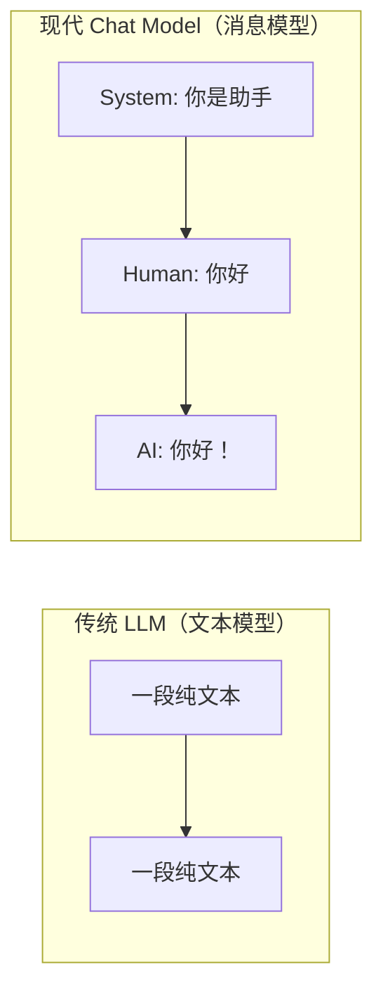
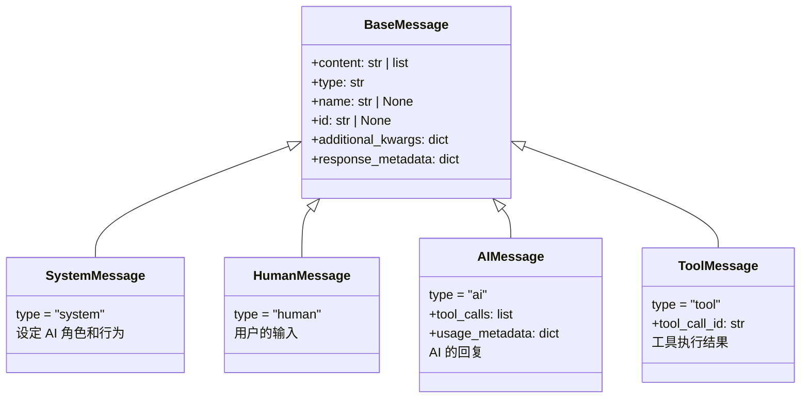
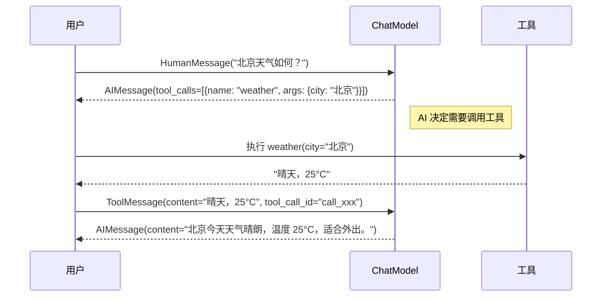
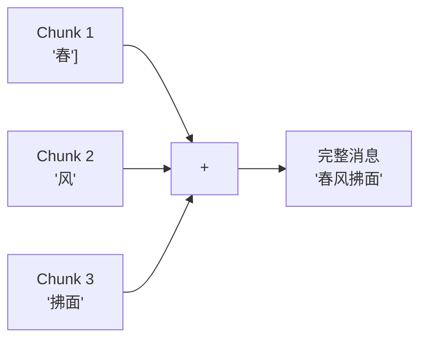

# 💬 第七章：消息系统（Messages）

## 📌 本章目标

- 理解 LangChain 的消息类型体系
- 掌握多模态消息的使用
- 了解 Tool Call 消息的工作流程
- 理解流式消息块（MessageChunk）

---

## 7.1 为什么需要消息系统？

聊天模型的输入不是简单的文本，而是一系列**带有角色**的消息。就像微信群聊 —— 每条消息都有"谁发的"这个信息。



LangChain 定义了一套完整的消息类型体系，来统一不同模型提供商的消息格式。

---

## 7.2 消息类型全家福



### 各类型消息详解

```python
from langchain_core.messages import (
    SystemMessage,
    HumanMessage,
    AIMessage,
    ToolMessage,
)

# 1️⃣ SystemMessage —— 系统指令
system = SystemMessage(content="你是一个友好的 AI 助手，请用简洁的中文回答")

# 2️⃣ HumanMessage —— 用户消息
human = HumanMessage(content="今天天气怎么样？")

# 3️⃣ AIMessage —— AI 的回复
ai = AIMessage(
    content="今天北京天气晴朗，气温 25°C。",
    response_metadata={
        "token_usage": {"prompt_tokens": 20, "completion_tokens": 15},
        "model_name": "gpt-4",
    }
)

# 4️⃣ ToolMessage —— 工具执行结果
tool_result = ToolMessage(
    content="北京：晴，25°C，湿度 45%",
    tool_call_id="call_abc123",  # 对应 AI 的 tool_call ID
)
```

### 类比 🎭

| 消息类型 | 现实类比 | 说明 |
|----------|----------|------|
| SystemMessage | 公司规章制度 | 规范 AI 的行为准则 |
| HumanMessage | 客户提问 | 用户输入 |
| AIMessage | 客服回答 | AI 的回复 |
| ToolMessage | 查询结果 | 工具/数据库返回的数据 |

---

## 7.3 消息的 content 字段

`content` 不只是字符串，它支持**多模态内容**：

```python
# 简单文本
msg = HumanMessage(content="你好")

# 多模态内容（文本 + 图片）
msg = HumanMessage(content=[
    {"type": "text", "text": "这张图片里有什么？"},
    {
        "type": "image_url",
        "image_url": {"url": "https://example.com/cat.jpg"}
    },
])

# 文本 + 多张图片
msg = HumanMessage(content=[
    {"type": "text", "text": "比较这两张图片的区别"},
    {"type": "image_url", "image_url": {"url": "https://example.com/img1.jpg"}},
    {"type": "image_url", "image_url": {"url": "https://example.com/img2.jpg"}},
])
```

### 内容块类型

```python
# 源码路径：libs/core/langchain_core/messages/content_blocks.py

# 文本块
{"type": "text", "text": "Hello"}

# 图片块
{"type": "image_url", "image_url": {"url": "...", "detail": "auto"}}

# 音频块
{"type": "input_audio", "input_audio": {"data": "base64...", "format": "wav"}}

# 视频块（部分模型支持）
{"type": "video_url", "video_url": {"url": "..."}}
```

> 💡 **为什么设计成列表？** 因为一条消息可能同时包含文本、图片、音频等多种内容，列表格式更灵活。这就像微信消息可以同时有文字和图片一样。

---

## 7.4 AIMessage 的特殊字段

AIMessage 除了 `content`，还有几个重要字段：

```python
ai_msg = AIMessage(
    # 基础回复文本
    content="让我来搜索一下天气信息。",
    
    # 工具调用（AI 决定要调用的工具）
    tool_calls=[
        {
            "name": "search_weather",
            "args": {"city": "北京"},
            "id": "call_abc123",
            "type": "tool_call",
        }
    ],
    
    # 响应元数据
    response_metadata={
        "token_usage": {
            "prompt_tokens": 50,
            "completion_tokens": 30,
            "total_tokens": 80,
        },
        "model_name": "gpt-4",
        "finish_reason": "tool_calls",
    },
    
    # 用量元数据
    usage_metadata={
        "input_tokens": 50,
        "output_tokens": 30,
        "total_tokens": 80,
    },
)
```

---

## 7.5 Tool Call 消息流程

当 AI 决定调用工具时，会产生一个完整的消息流：



对应的代码：

```python
from langchain_core.messages import HumanMessage, AIMessage, ToolMessage

# 完整的消息历史
messages = [
    # 1. 用户提问
    HumanMessage(content="北京天气如何？"),
    
    # 2. AI 决定调用工具（模型返回的）
    AIMessage(
        content="",
        tool_calls=[{"name": "weather", "args": {"city": "北京"}, "id": "call_001"}]
    ),
    
    # 3. 工具执行结果
    ToolMessage(content="晴天，25°C", tool_call_id="call_001"),
    
    # 4. 再次调用模型，让它基于工具结果回答
]

# 把所有消息传给模型
final_response = model.invoke(messages)
# AIMessage(content="北京今天天气晴朗，温度 25°C，适合外出活动。")
```

---

## 7.6 流式消息块（MessageChunk）

当使用 `stream()` 时，AI 的回复不是一次性返回的，而是逐块返回：

```python
from langchain_core.messages import AIMessageChunk

# 流式输出
for chunk in model.stream([HumanMessage(content="写一首诗")]):
    print(chunk.content, end="")
    # 每个 chunk 是一个 AIMessageChunk
    # chunk.content 可能是 "春" / "风" / "拂" / "面" ...
```

### MessageChunk 的合并

消息块可以通过 `+` 运算符合并：

```python
chunk1 = AIMessageChunk(content="你好")
chunk2 = AIMessageChunk(content="世界")

merged = chunk1 + chunk2
print(merged.content)  # "你好世界"
```

> 💡 **设计原理**：流式传输中，每个 chunk 只包含"增量"。LangChain 重载了 `__add__` 方法，让你可以轻松地把增量合并成完整消息。



---

## 7.7 消息的序列化

消息支持序列化为字典格式，方便存储和传输：

```python
from langchain_core.messages import HumanMessage, messages_to_dict, messages_from_dict

# 消息列表
messages = [
    HumanMessage(content="你好"),
    AIMessage(content="你好！有什么可以帮你的？"),
]

# 序列化为字典
dicts = messages_to_dict(messages)
# [
#   {"type": "human", "data": {"content": "你好", ...}},
#   {"type": "ai", "data": {"content": "你好！有什么可以帮你的？", ...}},
# ]

# 从字典反序列化
restored = messages_from_dict(dicts)
```

---

## 7.8 实际应用示例

### 多轮对话

```python
from langchain_openai import ChatOpenAI
from langchain_core.messages import SystemMessage, HumanMessage, AIMessage

model = ChatOpenAI(model="gpt-4")

# 维护消息历史
history = [
    SystemMessage(content="你是一个友好的中文助手"),
]

# 第一轮
history.append(HumanMessage(content="我叫小明"))
response = model.invoke(history)
history.append(response)  # 把 AI 回复加入历史

# 第二轮（AI 应该记得你的名字）
history.append(HumanMessage(content="我叫什么名字？"))
response = model.invoke(history)
print(response.content)  # "你叫小明。"
```

### 多模态对话（图片理解）

```python
model = ChatOpenAI(model="gpt-4o")  # 需要支持 vision 的模型

messages = [
    HumanMessage(content=[
        {"type": "text", "text": "描述这张图片中的内容"},
        {
            "type": "image_url",
            "image_url": {
                "url": "https://upload.wikimedia.org/wikipedia/commons/a/a7/Camponotus_flavomarginatus_ant.jpg",
                "detail": "high"  # 图片精度：low/high/auto
            }
        }
    ])
]

response = model.invoke(messages)
print(response.content)
# "这张图片展示了一只蚂蚁的特写照片..."
```

---

## 📌 本章小结

| 要点 | 内容 |
|------|------|
| 消息类型 | System / Human / AI / Tool |
| content 格式 | 字符串或多模态内容列表 |
| AIMessage 特殊字段 | tool_calls、response_metadata、usage_metadata |
| Tool Call 流程 | Human → AI(tool_calls) → Tool → AI(最终回复) |
| 流式消息 | AIMessageChunk，支持 `+` 合并 |
| 序列化 | messages_to_dict / messages_from_dict |

> ⏭️ 下一章，我们将学习如何用 LCEL [链式组合（Chains）](./08-chains.md) 这些组件，构建更复杂的 AI 工作流。
