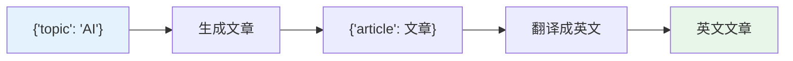
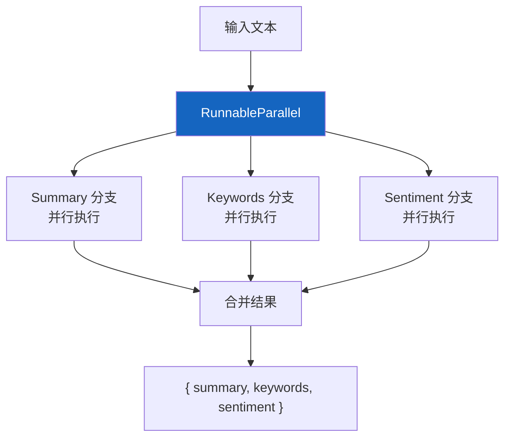
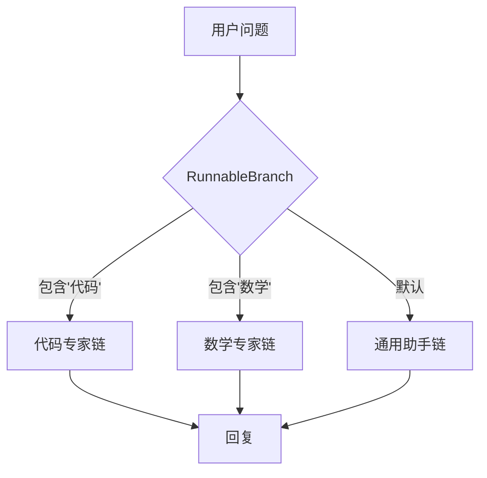
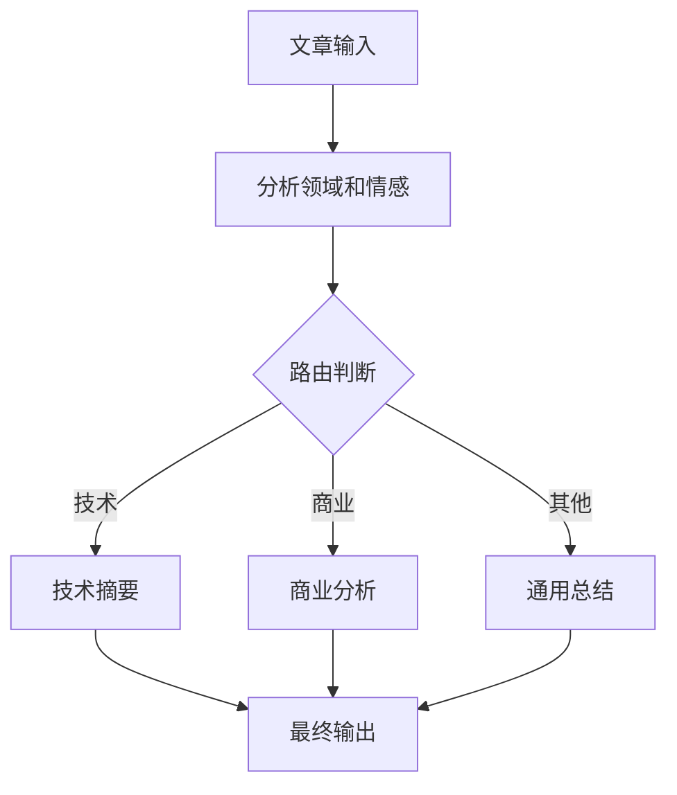

# 🔗 第八章：链式组合（Chains & LCEL）

## 📌 本章目标

- 掌握 LCEL 管道组合的进阶技巧
- 理解 RunnableSequence 和 RunnableParallel 的内部机制
- 学会构建复杂的 AI 工作流

---

## 8.1 从简单到复杂

在前面的章节中，我们已经见过最基本的链：

```python
chain = prompt | model | parser
```

但实际应用往往更复杂 —— 需要条件判断、并行处理、数据转换等。LCEL 提供了强大的组合能力来应对这些需求。

---

## 8.2 顺序链：数据流水线

### 基本模式

```python
from langchain_core.prompts import ChatPromptTemplate
from langchain_core.output_parsers import StrOutputParser
from langchain_openai import ChatOpenAI

model = ChatOpenAI(model="gpt-4")

# 步骤 1：生成文章
write_chain = (
    ChatPromptTemplate.from_template("写一篇关于{topic}的短文，200字以内")
    | model
    | StrOutputParser()
)

# 步骤 2：翻译文章
translate_chain = (
    ChatPromptTemplate.from_template("将以下文章翻译成英文：\n\n{article}")
    | model
    | StrOutputParser()
)

# 组合：生成 → 翻译
full_chain = write_chain | (lambda text: {"article": text}) | translate_chain

result = full_chain.invoke({"topic": "人工智能"})
```

### 数据流图



---

## 8.3 并行链：同时做多件事

### RunnableParallel

当需要同时执行多个独立任务时：

```python
from langchain_core.runnables import RunnableParallel

# 同时做三件事
analysis_chain = RunnableParallel(
    summary=(
        ChatPromptTemplate.from_template("用一句话总结：{text}")
        | model | StrOutputParser()
    ),
    keywords=(
        ChatPromptTemplate.from_template("提取关键词（逗号分隔）：{text}")
        | model | StrOutputParser()
    ),
    sentiment=(
        ChatPromptTemplate.from_template("判断情感（正面/负面/中性）：{text}")
        | model | StrOutputParser()
    ),
)

result = analysis_chain.invoke({"text": "今天去了一家新开的餐厅，味道非常好，环境也很棒！"})
# result = {
#   "summary": "用户在新餐厅用餐体验很好",
#   "keywords": "餐厅, 味道, 环境",
#   "sentiment": "正面"
# }
```

### 执行过程



> 💡 **性能优势**：三个任务并行执行，总耗时 ≈ 最慢的那个任务的时间（而不是三个之和）。

### 字典简写

Python 字典字面量也会被自动转换为 RunnableParallel：

```python
# 这两种写法等价：

# 写法一：显式
chain = RunnableParallel(question=RunnablePassthrough(), context=retriever)

# 写法二：字典简写
chain = {"question": RunnablePassthrough(), "context": retriever}
```

---

## 8.4 条件分支：根据输入走不同路径

### RunnableBranch

```python
from langchain_core.runnables import RunnableBranch

# 定义不同领域的处理链
code_chain = ChatPromptTemplate.from_template("你是代码专家。{question}") | model | StrOutputParser()
math_chain = ChatPromptTemplate.from_template("你是数学专家。{question}") | model | StrOutputParser()
general_chain = ChatPromptTemplate.from_template("你是通用助手。{question}") | model | StrOutputParser()

# 条件路由
branch = RunnableBranch(
    # (条件函数, 对应的链)
    (lambda x: "代码" in x["question"] or "编程" in x["question"], code_chain),
    (lambda x: "计算" in x["question"] or "数学" in x["question"], math_chain),
    general_chain,  # 默认链（最后一个参数）
)

# 会自动路由到 code_chain
result = branch.invoke({"question": "写一段 Python 排序代码"})
```

### 执行流程



### 用 RunnableLambda 实现更灵活的路由

```python
from langchain_core.runnables import RunnableLambda

def route(input_dict):
    """根据输入选择链"""
    question = input_dict["question"]
    if "代码" in question:
        return code_chain
    elif "数学" in question:
        return math_chain
    else:
        return general_chain

# 动态路由
chain = RunnableLambda(lambda x: route(x).invoke(x))
```

---

## 8.5 数据转换

### RunnableLambda：在链中插入自定义逻辑

```python
from langchain_core.runnables import RunnableLambda

# 自定义处理函数
def format_docs(docs: list) -> str:
    """将文档列表格式化为文本"""
    return "\n\n".join(doc.page_content for doc in docs)

def add_metadata(result: str) -> dict:
    """给结果添加元数据"""
    return {
        "answer": result,
        "timestamp": "2024-01-15T10:00:00Z",
        "model": "gpt-4",
    }

# 在链中使用自定义函数
chain = (
    retriever
    | RunnableLambda(format_docs)   # 格式化文档
    | prompt
    | model
    | StrOutputParser()
    | RunnableLambda(add_metadata)  # 添加元数据
)
```

> 💡 `RunnableLambda` 是 LCEL 的"胶水" —— 它让你在任何位置插入自定义的 Python 函数。

### RunnablePassthrough：保留原始输入

```python
from langchain_core.runnables import RunnablePassthrough

# 常见场景：RAG 中同时传递"问题"和"上下文"
chain = (
    {
        "context": retriever | format_docs,       # 检索文档
        "question": RunnablePassthrough(),         # 透传原始问题
    }
    | prompt    # prompt 中用 {context} 和 {question}
    | model
    | StrOutputParser()
)

result = chain.invoke("LangChain 是什么？")
```

### RunnablePassthrough.assign：追加字段

```python
from langchain_core.runnables import RunnablePassthrough

# 在原有输入上追加新字段
chain = RunnablePassthrough.assign(
    context=retriever | format_docs,     # 追加 context 字段
    # 原有的输入字段（如 question）会保留
)

result = chain.invoke({"question": "什么是 RAG？"})
# result = {"question": "什么是 RAG？", "context": "RAG 是..."}
```

---

## 8.6 实战案例：多步骤分析系统

```python
from langchain_core.prompts import ChatPromptTemplate
from langchain_core.output_parsers import StrOutputParser, JsonOutputParser
from langchain_core.runnables import RunnableParallel, RunnableLambda, RunnablePassthrough
from langchain_openai import ChatOpenAI

model = ChatOpenAI(model="gpt-4", temperature=0)

# === 第一步：内容分析 ===
analyze_prompt = ChatPromptTemplate.from_template(
    """分析以下文章的主题领域（技术/商业/文化/其他）和情感倾向（正面/负面/中性）。
只输出 JSON 格式：{{"domain": "...", "sentiment": "..."}}

文章：{article}"""
)

# === 第二步：根据领域生成不同风格的摘要 ===
tech_summary = ChatPromptTemplate.from_template(
    "你是技术编辑。请为这篇技术文章写一段专业摘要：\n{article}"
) | model | StrOutputParser()

business_summary = ChatPromptTemplate.from_template(
    "你是商业分析师。请提取这篇文章的商业洞察：\n{article}"
) | model | StrOutputParser()

general_summary = ChatPromptTemplate.from_template(
    "请用通俗的语言总结这篇文章：\n{article}"
) | model | StrOutputParser()

# === 组合链 ===
def route_by_domain(input_data):
    domain = input_data["analysis"]["domain"]
    article = input_data["article"]
    if domain == "技术":
        return tech_summary.invoke({"article": article})
    elif domain == "商业":
        return business_summary.invoke({"article": article})
    else:
        return general_summary.invoke({"article": article})

full_chain = (
    RunnablePassthrough.assign(
        analysis=analyze_prompt | model | JsonOutputParser()
    )
    | RunnableLambda(route_by_domain)
)

result = full_chain.invoke({"article": "GPT-5 发布，性能提升 300%..."})
```

### 流程图



---

## 8.7 链的调试技巧

### 查看链的结构

```python
# 打印链的结构
chain = prompt | model | parser
print(chain)
# first=ChatPromptTemplate(...)
# middle=[ChatOpenAI(model='gpt-4')]
# last=StrOutputParser()

# 获取输入/输出 Schema
print(chain.input_schema.model_json_schema())
# {"properties": {"topic": {"type": "string"}}, "required": ["topic"]}

print(chain.output_schema.model_json_schema())
# {"type": "string"}
```

### 中间结果查看

```python
from langchain_core.runnables import RunnableLambda

def debug_print(x):
    """调试用：打印中间结果"""
    print(f"[DEBUG] {type(x).__name__}: {str(x)[:200]}")
    return x  # 透传数据

# 在链的任意位置插入调试
chain = (
    prompt
    | RunnableLambda(debug_print)   # 查看 Prompt 输出
    | model
    | RunnableLambda(debug_print)   # 查看模型输出
    | parser
)
```

---

## 8.8 传统 Chain vs LCEL

LangChain 中有两种链的方式：**传统 Chain 类**（旧）和 **LCEL**（新，推荐）。

### 对比

```python
# ❌ 传统方式（旧，逐步废弃中）
from langchain.chains import LLMChain

chain = LLMChain(
    llm=model,
    prompt=prompt,
    output_parser=parser,
)
result = chain.run(topic="AI")

# ✅ LCEL 方式（推荐）
chain = prompt | model | parser
result = chain.invoke({"topic": "AI"})
```

| 对比项 | 传统 Chain | LCEL |
|--------|-----------|------|
| 语法 | 类实例化 | 管道符组合 |
| 流式 | 需要额外实现 | 自动支持 |
| 异步 | 需要额外实现 | 自动支持 |
| 并行 | 手动管理 | RunnableParallel 内置 |
| 组合性 | 嵌套类 | 简洁的管道 |
| 学习成本 | 需要记忆各种 Chain 类 | 只需理解 Runnable |
| 推荐 | ⚠️ 兼容方案 | ✅ 推荐 |

> 💡 **迁移建议**：新代码统一用 LCEL。传统 Chain 类（LLMChain、RetrievalQA 等）仍然可用，但 LangChain 团队不再新增此类功能。

---

## 📌 本章小结

| 要点 | 内容 |
|------|------|
| 顺序组合 | `step1 \| step2 \| step3`（RunnableSequence） |
| 并行组合 | `RunnableParallel(a=..., b=...)`（同时执行） |
| 条件路由 | `RunnableBranch` 按条件选择不同链 |
| 数据转换 | `RunnableLambda` 插入自定义函数 |
| 透传输入 | `RunnablePassthrough` 保留原始数据 |
| 追加字段 | `RunnablePassthrough.assign()` |
| 调试 | 打印链结构、插入 debug 函数 |
| LCEL vs Chain | LCEL 是推荐方式 |

> ⏭️ 下一章，我们将学习如何 [加载文档（Document Loaders）](./09-document-loaders.md)，这是构建 RAG 系统的第一步。
