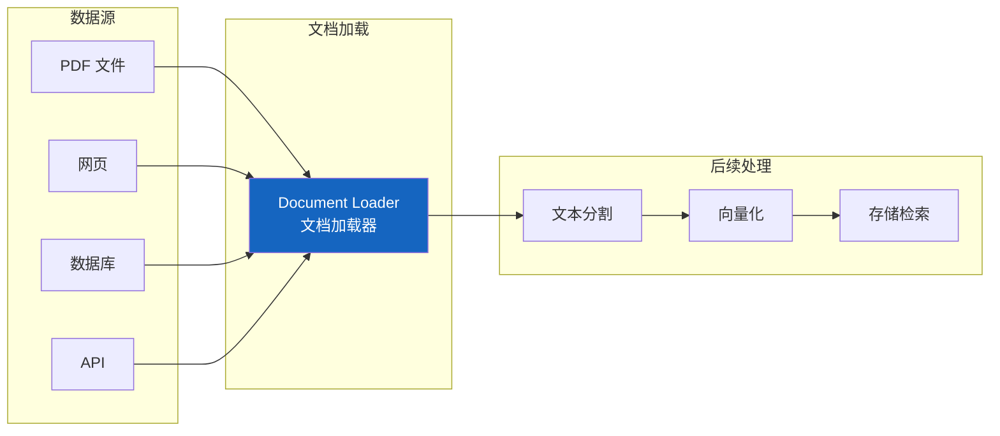
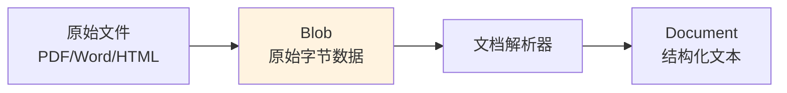

# 📂 第九章：文档加载（Document Loaders）

## 📌 本章目标

- 理解 Document 和 Blob 的数据模型
- 了解常用的文档加载器
- 掌握加载各类数据源的方法

---

## 9.1 为什么需要文档加载？

大语言模型的训练数据有截止日期，且不包含你的私有数据。要让 AI 基于**你的数据**回答问题（RAG），第一步就是把数据**加载**进来。



> 💡 **类比**：文档加载器就像"数据搬运工" —— 负责把散落在各处的数据搬到 LangChain 的"仓库"（Document 对象）里。

---

## 9.2 Document 数据模型

所有加载器最终都输出 `Document` 对象：

```python
# 源码路径：libs/core/langchain_core/documents/base.py
class Document(BaseMedia):
    """文档对象 —— LangChain 中数据的标准载体"""
    
    page_content: str       # 📝 文本内容
    metadata: dict = {}     # 📋 元数据（来源、页码、时间等）
    id: str | None = None   # 🔑 可选的唯一标识
```

### 实例

```python
from langchain_core.documents import Document

doc = Document(
    page_content="LangChain 是一个 LLM 应用开发框架...",
    metadata={
        "source": "langchain_docs.pdf",   # 来源文件
        "page": 1,                         # 页码
        "author": "LangChain Team",        # 作者
        "created_at": "2024-01-15",        # 创建时间
    },
    id="doc_001",
)

print(doc.page_content)   # 文本内容
print(doc.metadata)       # 元数据
```

### 为什么要有 metadata？

metadata 在后续的检索和引用溯源中至关重要：

| 元数据字段 | 用途 |
|-----------|------|
| `source` | 引用来源（用户可以看到答案出自哪个文件） |
| `page` | 定位到具体页码 |
| `chunk_index` | 分割后的块序号 |
| `created_at` | 时间过滤（只搜索最近的文档） |
| 自定义字段 | 按需添加（类别、标签等） |

---

## 9.3 Blob：原始数据抽象

在加载二进制文件（PDF、图片等）时，LangChain 使用 `Blob` 作为中间表示：

```python
from langchain_core.documents.base import Blob

# 从文件路径创建
blob = Blob.from_path("document.pdf")

# 从内存数据创建
blob = Blob.from_data(
    data=b"raw bytes...",
    mime_type="application/pdf",
    path="document.pdf",
)
```



---

## 9.4 常用文档加载器

### 文本文件

```python
from langchain_community.document_loaders import TextLoader

# 加载纯文本文件
loader = TextLoader("example.txt", encoding="utf-8")
docs = loader.load()  # 返回 list[Document]

print(docs[0].page_content)   # 文件内容
print(docs[0].metadata)       # {"source": "example.txt"}
```

### CSV 文件

```python
from langchain_community.document_loaders import CSVLoader

# 每一行变成一个 Document
loader = CSVLoader("data.csv")
docs = loader.load()

# 第一行：Document(page_content="name: 张三\nage: 25\ncity: 北京")
```

### PDF 文件

```python
from langchain_community.document_loaders import PyPDFLoader

# 每一页变成一个 Document
loader = PyPDFLoader("report.pdf")
docs = loader.load()

print(len(docs))              # 页数
print(docs[0].page_content)   # 第一页内容
print(docs[0].metadata)       # {"source": "report.pdf", "page": 0}
```

### 网页

```python
from langchain_community.document_loaders import WebBaseLoader

# 加载网页内容
loader = WebBaseLoader("https://example.com/article")
docs = loader.load()

print(docs[0].page_content)   # 网页的文本内容（去除 HTML 标签）
```

### Markdown

```python
from langchain_community.document_loaders import UnstructuredMarkdownLoader

loader = UnstructuredMarkdownLoader("README.md")
docs = loader.load()
```

### 目录批量加载

```python
from langchain_community.document_loaders import DirectoryLoader

# 加载整个目录下的所有 .txt 文件
loader = DirectoryLoader(
    "docs/",
    glob="**/*.txt",         # 文件匹配模式
    loader_cls=TextLoader,    # 使用的加载器
    show_progress=True,       # 显示进度条
)
docs = loader.load()
```

---

## 9.5 加载器的设计模式

### BaseLoader 接口

```python
# 源码路径：libs/core/langchain_core/document_loaders/base.py
class BaseLoader(ABC):
    """文档加载器基类"""
    
    @abstractmethod
    def lazy_load(self) -> Iterator[Document]:
        """惰性加载 —— 逐个返回文档（节省内存）"""
    
    def load(self) -> list[Document]:
        """一次性加载所有文档"""
        return list(self.lazy_load())
```

### 惰性加载 vs 一次性加载

```python
# 一次性加载（小文件适用）
docs = loader.load()  # list[Document]，全部加载到内存

# 惰性加载（大文件推荐）
for doc in loader.lazy_load():  # Iterator[Document]，逐个处理
    process(doc)
    # 上一个 doc 处理完后自动释放内存
```

> 💡 **类比**：
> - `load()` = 把整个卡车的货物一次搬进仓库
> - `lazy_load()` = 一件一件搬，搬完一件处理一件

---

## 9.6 自定义加载器

当内置加载器不满足需求时，可以自定义：

```python
from langchain_core.document_loaders import BaseLoader
from langchain_core.documents import Document
from typing import Iterator

class DatabaseLoader(BaseLoader):
    """从数据库加载文档的自定义加载器"""
    
    def __init__(self, connection_string: str, query: str):
        self.connection_string = connection_string
        self.query = query
    
    def lazy_load(self) -> Iterator[Document]:
        """逐行返回文档"""
        import sqlite3
        conn = sqlite3.connect(self.connection_string)
        cursor = conn.execute(self.query)
        
        for row in cursor:
            yield Document(
                page_content=row[1],  # 假设第 2 列是内容
                metadata={
                    "id": row[0],
                    "source": "database",
                    "table": "articles",
                },
            )
        conn.close()

# 使用
loader = DatabaseLoader("data.db", "SELECT id, content FROM articles")
docs = loader.load()
```

---

## 9.7 与下游组件的连接

文档加载只是数据处理流水线的第一步：


```python
from langchain_community.document_loaders import PyPDFLoader
from langchain_text_splitters import RecursiveCharacterTextSplitter
from langchain_openai import OpenAIEmbeddings
from langchain_chroma import Chroma

# 1. 加载
docs = PyPDFLoader("manual.pdf").load()

# 2. 分割（下一章详细讲）
splitter = RecursiveCharacterTextSplitter(chunk_size=1000, chunk_overlap=200)
chunks = splitter.split_documents(docs)

# 3. 向量化 + 存储
vectorstore = Chroma.from_documents(chunks, OpenAIEmbeddings())

# 4. 检索
retriever = vectorstore.as_retriever()
results = retriever.invoke("如何安装？")
```

---

## 📌 本章小结

| 要点 | 内容 |
|------|------|
| Document | LangChain 数据的标准载体（page_content + metadata） |
| Blob | 二进制数据的中间表示 |
| BaseLoader | 加载器基类，实现 lazy_load 方法 |
| 惰性加载 | lazy_load 逐个返回，节省内存 |
| 常用加载器 | Text、CSV、PDF、Web、Markdown、Directory |
| 自定义加载器 | 继承 BaseLoader，实现 lazy_load |

> ⏭️ 下一章，我们将学习 [文本分割（Text Splitters）](./10-text-splitters.md) —— 把长文档切成适合 AI 处理的小块。
