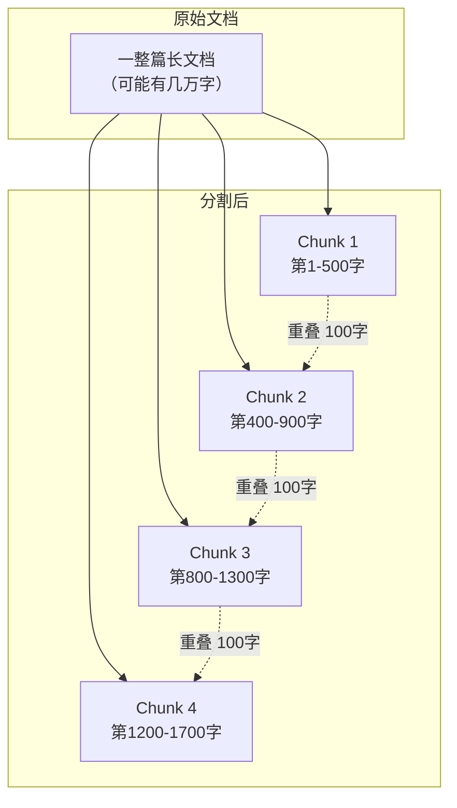
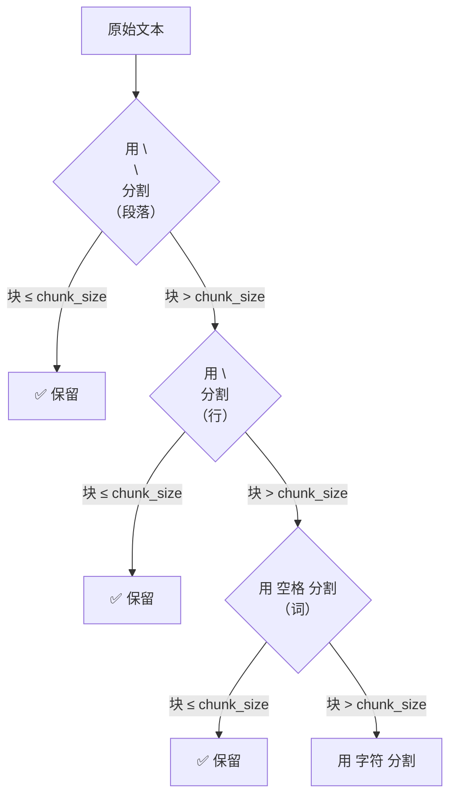
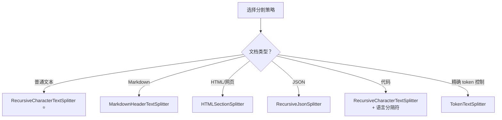

# ✂️ 第十章：文本分割（Text Splitters）

## 📌 本章目标

- 理解为什么需要文本分割
- 掌握核心概念：chunk_size 和 chunk_overlap
- 了解不同分割策略的适用场景

---

## 10.1 为什么需要文本分割？

LLM 有 **上下文窗口限制**（Context Window），一次处理不了太长的文本：

| 模型 | 上下文窗口 | 约等于 |
|------|-----------|--------|
| GPT-3.5 | 4K tokens | ~3,000 字中文 |
| GPT-4 | 8K-128K tokens | ~6,000-96,000 字中文 |
| Claude 3 | 200K tokens | ~150,000 字中文 |

但一本书可能有几十万字！必须先把长文档**切成小块**（chunks）。

### 类比 🍞

> 文本分割就像切面包 —— 一整条面包太大，一口吃不下。我们需要切成合适大小的片，而且相邻的片要有一点"重叠"（overlap），这样才不会漏掉跨越切割点的信息。



---

## 10.2 核心概念

### chunk_size 和 chunk_overlap

```python
from langchain_text_splitters import RecursiveCharacterTextSplitter

splitter = RecursiveCharacterTextSplitter(
    chunk_size=500,       # 每块最大 500 个字符
    chunk_overlap=100,    # 相邻块重叠 100 个字符
)
```

| 参数 | 含义 | 类比 |
|------|------|------|
| `chunk_size` | 每个块的最大长度 | 面包片的厚度 |
| `chunk_overlap` | 相邻块之间的重叠长度 | 切面包时的"重叠区域" |

### 为什么需要 overlap？

```
没有 overlap 时 ❌：
  块1: "...LangChain 是一个"     块2: "开发框架，它支持..."
  → 搜索"LangChain开发框架"时，两个块都匹配不上！

有 overlap 时 ✅：
  块1: "...LangChain 是一个开发框架"     块2: "一个开发框架，它支持..."
  → 搜索"LangChain开发框架"时，块1能完整匹配！
```

---

## 10.3 分割策略详解

### 策略一：RecursiveCharacterTextSplitter ⭐（最常用）

**原理**：按照一组优先级递减的分隔符来分割。先尝试用段落分隔符（`\n\n`），如果块还是太大，再用行分隔符（`\n`），最后用空格和字符。

```python
from langchain_text_splitters import RecursiveCharacterTextSplitter

splitter = RecursiveCharacterTextSplitter(
    chunk_size=1000,
    chunk_overlap=200,
    separators=["\n\n", "\n", " ", ""],  # 默认分隔符优先级
)

text = """第一章：简介

LangChain 是一个强大的框架。
它让 LLM 应用开发变得简单。

第二章：核心概念

Runnable 是核心接口。
所有组件都实现了 Runnable。"""

chunks = splitter.split_text(text)
for i, chunk in enumerate(chunks):
    print(f"--- Chunk {i+1} ---")
    print(chunk)
```

> 💡 **为什么叫"递归"？** 因为它递归地尝试不同的分隔符 —— 先切大块（段落），大块超长了再切小块（行），还超长就切更小（空格），最终保证每块不超过 chunk_size。

### 分割过程图解



### 策略二：CharacterTextSplitter

最简单的分割 —— 只用一个分隔符：

```python
from langchain_text_splitters import CharacterTextSplitter

splitter = CharacterTextSplitter(
    separator="\n\n",       # 只按段落分割
    chunk_size=1000,
    chunk_overlap=200,
)
```

### 策略三：TokenTextSplitter

按 **token 数**而非字符数分割（更精确）：

```python
from langchain_text_splitters import TokenTextSplitter

splitter = TokenTextSplitter(
    chunk_size=500,          # 每块最多 500 tokens
    chunk_overlap=50,
    encoding_name="cl100k_base",  # OpenAI 的 tokenizer
)
```

> 💡 **为什么按 token 分割更好？** 因为 LLM 的限制是 token 数，而非字符数。一个中文字可能是 1-2 个 token，一个英文单词也可能是 1-3 个 token。按 token 分割能更精确地利用上下文窗口。

### 策略四：MarkdownHeaderTextSplitter

按 Markdown 标题层级分割，保留文档结构：

```python
from langchain_text_splitters import MarkdownHeaderTextSplitter

splitter = MarkdownHeaderTextSplitter(
    headers_to_split_on=[
        ("#", "H1"),
        ("##", "H2"),
        ("###", "H3"),
    ]
)

markdown_text = """
# 第一章：简介
这是简介内容...

## 1.1 背景
这是背景内容...

## 1.2 目标
这是目标内容...

# 第二章：核心
这是核心内容...
"""

chunks = splitter.split_text(markdown_text)
# chunks[0].metadata = {"H1": "第一章：简介"}
# chunks[1].metadata = {"H1": "第一章：简介", "H2": "1.1 背景"}
# ...
```

> 💡 **好处**：保留了层级信息到 metadata 中，后续检索时可以知道每个块"属于哪个章节"。

### 策略五：HTMLSectionSplitter

按 HTML 标签分割：

```python
from langchain_text_splitters import HTMLSectionSplitter

splitter = HTMLSectionSplitter(
    headers_to_split_on=[
        ("h1", "H1"),
        ("h2", "H2"),
    ]
)
```

### 策略六：RecursiveJsonSplitter

分割大型 JSON 数据：

```python
from langchain_text_splitters import RecursiveJsonSplitter

splitter = RecursiveJsonSplitter(max_chunk_size=300)

large_json = {
    "users": [
        {"name": "张三", "age": 25, "bio": "...很长的内容..."},
        {"name": "李四", "age": 30, "bio": "...很长的内容..."},
    ]
}

chunks = splitter.split_json(large_json)
```

---

## 10.4 分割策略选择指南



### 代码分割

```python
from langchain_text_splitters import RecursiveCharacterTextSplitter, Language

# Python 代码分割（按函数/类边界）
python_splitter = RecursiveCharacterTextSplitter.from_language(
    language=Language.PYTHON,
    chunk_size=2000,
    chunk_overlap=200,
)

# JavaScript / TypeScript 代码分割
js_splitter = RecursiveCharacterTextSplitter.from_language(
    language=Language.JS,
    chunk_size=2000,
    chunk_overlap=200,
)
```

---

## 10.5 分割文档 vs 分割文本

```python
from langchain_text_splitters import RecursiveCharacterTextSplitter
from langchain_core.documents import Document

splitter = RecursiveCharacterTextSplitter(chunk_size=500, chunk_overlap=100)

# 方式一：分割纯文本
chunks = splitter.split_text("很长的文本...")
# 返回 list[str]

# 方式二：分割 Document 对象（推荐）
docs = [Document(page_content="很长的文本...", metadata={"source": "file.txt"})]
chunks = splitter.split_documents(docs)
# 返回 list[Document]，每个 chunk 继承原始的 metadata
```

> 💡 `split_documents` 更常用，因为它会把原始文档的 metadata（来源、页码等）传递给每个分割后的块。

---

## 10.6 chunk_size 的选择经验

| 场景 | 推荐 chunk_size | 理由 |
|------|----------------|------|
| QA（问答） | 500-1000 字符 | 块太大会引入噪音，太小会丢失上下文 |
| 摘要 | 2000-4000 字符 | 需要更多上下文来理解内容 |
| 代码分析 | 1500-3000 字符 | 一个函数/类通常在这个范围 |
| 聊天机器人 | 500-1500 字符 | 快速检索，控制 token 成本 |

> 💡 **经验法则**：没有"最佳"的 chunk_size，需要根据实际效果调优。建议从 1000 开始，根据检索质量和成本来调整。

---

## 📌 本章小结

| 要点 | 内容 |
|------|------|
| 为什么分割 | LLM 上下文有限，必须把长文档切小 |
| 核心参数 | chunk_size（块大小）、chunk_overlap（重叠） |
| 推荐策略 | RecursiveCharacterTextSplitter（通用） |
| 结构化分割 | MarkdownHeader / HTMLSection（保留结构） |
| Token 分割 | TokenTextSplitter（精确控制 token 数） |
| 代码分割 | from_language 方法（按语言语法分割） |

> ⏭️ 下一章，我们将学习 [嵌入与向量存储](./11-embeddings-vectorstores.md) —— 把文本转化为向量，实现语义搜索。
