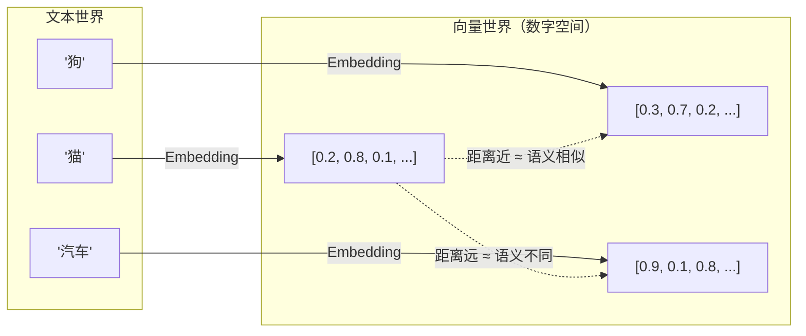
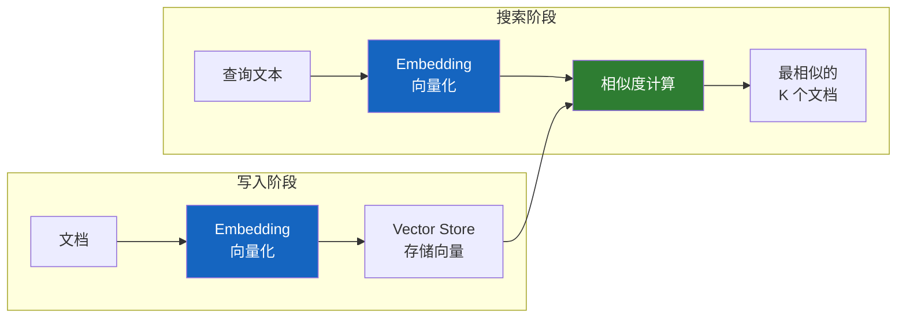
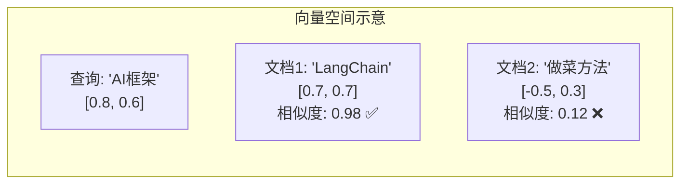

# 🧮 第十一章：嵌入与向量存储（Embeddings & Vector Stores）

## 📌 本章目标

- 理解文本嵌入（Embedding）的原理
- 掌握向量存储（Vector Store）的使用
- 了解相似度搜索的工作机制

---

## 11.1 从文本到向量：什么是 Embedding？

**Embedding**（嵌入）是把文本转换为**数学向量**的过程。

> 🎯 一句话：Embedding 就是让计算机"理解"语义 —— 把人类的文字变成机器能计算的数字。

### 类比 🗺️

想象一张"语义地图"：
- "猫"和"狗"在地图上的距离很近（都是宠物）
- "猫"和"汽车"在地图上的距离很远（完全不同的概念）
- "快乐"和"高兴"几乎在同一个位置（同义词）



### 技术原理

```python
# 一个文本会被转换成一个高维向量（通常 768-3072 维）
text = "LangChain 是一个强大的 AI 开发框架"

embedding = [0.023, -0.156, 0.089, ..., 0.034]  # 1536 个浮点数（OpenAI）
# 这些数字编码了文本的"语义信息"
```

---

## 11.2 Embeddings 接口

```python
# 源码路径：libs/core/langchain_core/embeddings/embeddings.py
class Embeddings(ABC):
    """文本嵌入接口"""
    
    @abstractmethod
    def embed_documents(self, texts: list[str]) -> list[list[float]]:
        """批量嵌入文档文本"""
    
    @abstractmethod
    def embed_query(self, text: str) -> list[float]:
        """嵌入查询文本"""
```

### 为什么分 embed_documents 和 embed_query？

某些嵌入模型对"文档"和"查询"使用不同的编码策略（如 E5 模型会给查询加前缀 "query:"）。

### 使用示例

```python
from langchain_openai import OpenAIEmbeddings

embeddings = OpenAIEmbeddings(model="text-embedding-3-small")

# 嵌入单个查询
query_vector = embeddings.embed_query("什么是 LangChain？")
print(len(query_vector))  # 1536（向量维度）

# 批量嵌入文档
doc_vectors = embeddings.embed_documents([
    "LangChain 是一个 AI 框架",
    "Python 是一门编程语言",
    "今天天气很好",
])
print(len(doc_vectors))      # 3（3 个文档）
print(len(doc_vectors[0]))   # 1536（每个向量的维度）
```

---

## 11.3 向量存储（Vector Store）

有了向量，需要一个地方来**存储**和**搜索**它们 —— 这就是 Vector Store（向量数据库）。

### 类比 📚

| 对比 | 传统数据库 | 向量数据库 |
|------|-----------|-----------|
| 搜索方式 | 关键词精确匹配 | 语义相似度 |
| 搜索 "宠物" | 只匹配包含"宠物"的记录 | 同时匹配"猫"、"狗"、"金鱼"等 |
| 适合场景 | 结构化查询 | 自然语言搜索 |

### VectorStore 接口

```python
# 源码路径：libs/core/langchain_core/vectorstores/base.py
class VectorStore(ABC):
    """向量存储基类"""
    
    def add_texts(self, texts: list[str], metadatas: list[dict] = None) -> list[str]:
        """添加文本（自动嵌入后存储）"""
    
    def add_documents(self, documents: list[Document]) -> list[str]:
        """添加文档"""
    
    def similarity_search(self, query: str, k: int = 4) -> list[Document]:
        """语义搜索 —— 返回最相似的 k 个文档"""
    
    def similarity_search_with_score(self, query: str, k: int = 4):
        """搜索并返回相似度分数"""
    
    def delete(self, ids: list[str]) -> bool:
        """删除文档"""
    
    def as_retriever(self, **kwargs) -> VectorStoreRetriever:
        """转换为 Retriever（可参与 LCEL 链）"""
```

---

## 11.4 实战：构建向量搜索

### 完整流程

```python
from langchain_openai import OpenAIEmbeddings
from langchain_chroma import Chroma
from langchain_core.documents import Document

# 1. 准备文档
documents = [
    Document(page_content="LangChain 是一个 LLM 应用开发框架", metadata={"topic": "AI"}),
    Document(page_content="Python 是世界上最流行的编程语言之一", metadata={"topic": "编程"}),
    Document(page_content="机器学习是人工智能的一个分支", metadata={"topic": "AI"}),
    Document(page_content="React 是一个前端 JavaScript 框架", metadata={"topic": "前端"}),
    Document(page_content="深度学习使用神经网络来处理数据", metadata={"topic": "AI"}),
]

# 2. 创建向量存储（自动嵌入 + 存储）
vectorstore = Chroma.from_documents(
    documents=documents,
    embedding=OpenAIEmbeddings(),
)

# 3. 语义搜索
results = vectorstore.similarity_search("AI 框架是什么？", k=2)
for doc in results:
    print(f"[{doc.metadata['topic']}] {doc.page_content}")
# 输出：
# [AI] LangChain 是一个 LLM 应用开发框架
# [AI] 机器学习是人工智能的一个分支
```

### 流程图



---

## 11.5 常见向量数据库

LangChain 支持多种向量数据库，通过集成包提供：

| 向量数据库 | 安装包 | 特点 | 适用场景 |
|-----------|--------|------|----------|
| **Chroma** | `langchain-chroma` | 轻量、嵌入式 | 开发/原型 |
| **Qdrant** | `langchain-qdrant` | 高性能、生产级 | 生产环境 |
| **FAISS** | `langchain-community` | Meta 开源、速度快 | 大规模检索 |
| **Pinecone** | `langchain-pinecone` | 云托管、免运维 | 不想运维的团队 |
| **Weaviate** | `langchain-weaviate` | 混合搜索 | 需要关键词+语义混合 |
| **Milvus** | `langchain-milvus` | 分布式、大规模 | 海量数据 |

---

## 11.6 相似度搜索的原理

### 余弦相似度（Cosine Similarity）

最常用的相似度计算方式：

```
相似度 = cos(θ) = A·B / (|A| × |B|)

值域：[-1, 1]
  1  = 完全相同
  0  = 完全无关
 -1  = 完全相反
```



### 搜索过程

```python
# 简化版原理（实际使用向量数据库的优化算法）

def similarity_search(query: str, documents: list, k: int = 4):
    # 1. 把查询文本向量化
    query_vector = embeddings.embed_query(query)
    
    # 2. 计算查询向量与每个文档向量的相似度
    scores = []
    for doc, doc_vector in documents:
        similarity = cosine_similarity(query_vector, doc_vector)
        scores.append((doc, similarity))
    
    # 3. 按相似度排序，返回 top-k
    scores.sort(key=lambda x: x[1], reverse=True)
    return [doc for doc, score in scores[:k]]
```

---

## 11.7 高级搜索功能

### 带分数的搜索

```python
results = vectorstore.similarity_search_with_score("AI 框架", k=3)
for doc, score in results:
    print(f"[相似度: {score:.4f}] {doc.page_content}")
# [相似度: 0.9823] LangChain 是一个 LLM 应用开发框架
# [相似度: 0.8745] 机器学习是人工智能的一个分支
# [相似度: 0.6123] 深度学习使用神经网络来处理数据
```

### 元数据过滤

```python
# 只在特定类别中搜索
results = vectorstore.similarity_search(
    "框架",
    k=2,
    filter={"topic": "AI"},   # 只搜索 AI 主题的文档
)
```

### 最大边际相关性搜索（MMR）

MMR（Maximal Marginal Relevance）在保证相关性的同时增加结果多样性：

```python
# MMR 搜索 —— 结果更加多样化
results = vectorstore.max_marginal_relevance_search(
    "AI 技术",
    k=3,
    fetch_k=10,         # 先获取 10 个候选
    lambda_mult=0.5,    # 多样性参数（0=最大多样性，1=最相关）
)
```

> 💡 **为什么需要 MMR？** 普通搜索可能返回 3 个意思几乎相同的文档。MMR 会在相关的前提下，尽量返回"不同角度"的文档。

---

## 11.8 转换为 Retriever

Vector Store 可以通过 `as_retriever()` 转换为 Retriever，从而参与 LCEL 链：

```python
# 创建检索器
retriever = vectorstore.as_retriever(
    search_type="similarity",    # 或 "mmr"
    search_kwargs={"k": 3},      # 返回 3 个结果
)

# 作为 Runnable 使用
docs = retriever.invoke("什么是 LangChain？")

# 参与 LCEL 链
chain = retriever | format_docs | prompt | model | parser
```

> 💡 这个转换是连接"数据层"和"AI 推理层"的桥梁，将在下一章 RAG 中详细展开。

---

## 📌 本章小结

| 要点 | 内容 |
|------|------|
| Embedding | 把文本转换为高维向量，编码语义信息 |
| 向量相似度 | 语义越相似，向量距离越近 |
| VectorStore | 存储向量 + 相似度搜索 |
| 常用数据库 | Chroma（开发）、Qdrant/FAISS（生产） |
| 搜索方式 | 普通相似度、带分数、MMR、元数据过滤 |
| as_retriever | 转换为 Runnable，可参与 LCEL 链 |

> ⏭️ 下一章，我们将把文档加载、分割、嵌入、存储串联起来，构建完整的 [RAG 系统](./12-retrievers-rag.md)。
