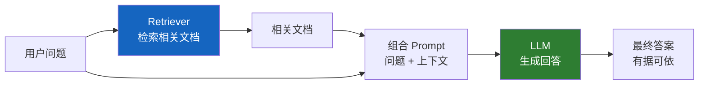
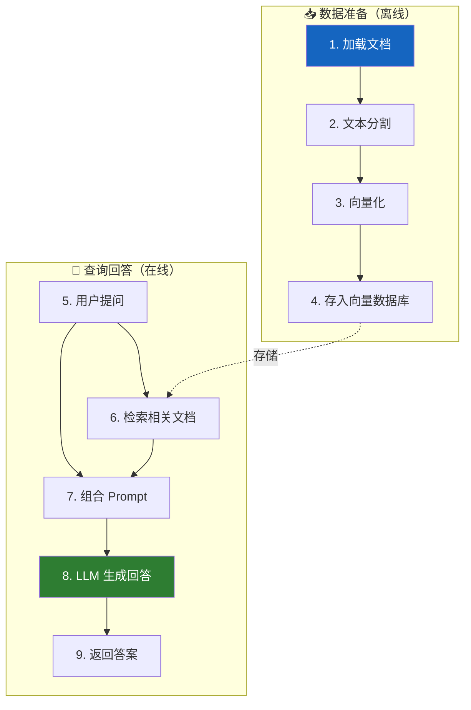
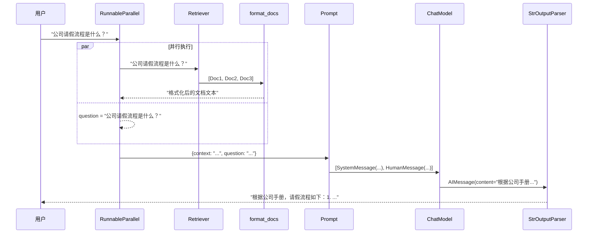
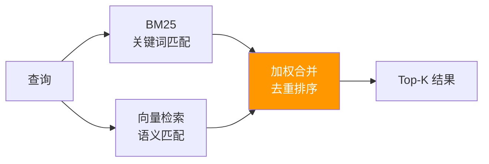

# 🔍 第十二章：检索增强生成（RAG）

## 📌 本章目标

- 理解 RAG 的原理和为什么需要它
- 掌握 Retriever 接口的设计
- 学会构建完整的 RAG 流水线

---

## 12.1 什么是 RAG？

**RAG**（Retrieval-Augmented Generation，检索增强生成）是让 LLM **基于外部知识**回答问题的技术。

### 为什么需要 RAG？

LLM 有两个根本局限：

1. **知识截止**：训练数据有截止日期，不知道最新信息
2. **幻觉问题**：对于不知道的问题，LLM 可能会"编造"答案

> 🎯 RAG 的核心思想：**先搜索，再回答** —— 先从你的知识库中检索相关内容，再把检索到的内容喂给 LLM，让它基于"证据"来回答。

### 类比 📖

| 场景 | 没有 RAG | 有 RAG |
|------|---------|--------|
| 类比 | 闭卷考试（全凭记忆） | 开卷考试（可以翻书） |
| AI 行为 | "我记得答案是…（可能记错）" | "根据资料，答案是…（有据可依）" |
| 结果质量 | 可能有"幻觉" | 有来源、可验证 |

### RAG 流程



---

## 12.2 Retriever 接口

```python
# 源码路径：libs/core/langchain_core/retrievers.py
class BaseRetriever(RunnableSerializable[str, list[Document]], ABC):
    """检索器基类 —— 输入查询文本，输出相关文档列表"""
    
    @abstractmethod
    def _get_relevant_documents(
        self, query: str, *, run_manager: CallbackManagerForRetrieverRun
    ) -> list[Document]:
        """核心实现方法"""
    
    # 继承自 Runnable 的方法（自动获得）：
    # invoke(query) -> list[Document]
    # ainvoke(query) -> list[Document]
    # batch(queries) -> list[list[Document]]
```

> 🔑 **关键设计**：Retriever 继承自 `RunnableSerializable`，所以它天然可以参与 LCEL 链！

### 使用示例

```python
# 从 VectorStore 创建 Retriever
retriever = vectorstore.as_retriever(search_kwargs={"k": 3})

# 作为 Runnable 使用
docs = retriever.invoke("什么是 LangChain？")
for doc in docs:
    print(f"[{doc.metadata.get('source', '未知')}] {doc.page_content[:100]}...")
```

---

## 12.3 构建完整的 RAG 系统

### 步骤总览



### 完整代码

```python
from langchain_openai import ChatOpenAI, OpenAIEmbeddings
from langchain_chroma import Chroma
from langchain_core.prompts import ChatPromptTemplate
from langchain_core.output_parsers import StrOutputParser
from langchain_core.runnables import RunnablePassthrough
from langchain_text_splitters import RecursiveCharacterTextSplitter
from langchain_community.document_loaders import PyPDFLoader

# ====== 第一阶段：数据准备 ======

# 1. 加载文档
loader = PyPDFLoader("company_manual.pdf")
docs = loader.load()
print(f"加载了 {len(docs)} 页文档")

# 2. 文本分割
splitter = RecursiveCharacterTextSplitter(
    chunk_size=1000,
    chunk_overlap=200,
)
chunks = splitter.split_documents(docs)
print(f"分割成 {len(chunks)} 个文本块")

# 3 & 4. 向量化 + 存储
vectorstore = Chroma.from_documents(
    documents=chunks,
    embedding=OpenAIEmbeddings(),
    persist_directory="./chroma_db",   # 持久化到磁盘
)

# ====== 第二阶段：查询回答 ======

# 5. 创建检索器
retriever = vectorstore.as_retriever(search_kwargs={"k": 3})

# 6. 定义 Prompt 模板
prompt = ChatPromptTemplate.from_messages([
    ("system", """你是一个专业的问答助手。请基于以下参考资料回答用户问题。
如果参考资料中没有相关信息，请如实告知用户。

参考资料：
{context}"""),
    ("human", "{question}"),
])

# 7. 文档格式化函数
def format_docs(docs):
    return "\n\n---\n\n".join(
        f"[来源: {doc.metadata.get('source', '未知')}, 页码: {doc.metadata.get('page', '?')}]\n{doc.page_content}"
        for doc in docs
    )

# 8. 组合 RAG 链
rag_chain = (
    {
        "context": retriever | format_docs,      # 检索 → 格式化
        "question": RunnablePassthrough(),         # 透传问题
    }
    | prompt                                       # 构造 Prompt
    | ChatOpenAI(model="gpt-4", temperature=0)    # 调用 LLM
    | StrOutputParser()                            # 提取文本
)

# 9. 使用！
answer = rag_chain.invoke("公司的请假流程是什么？")
print(answer)
```

---

## 12.4 RAG 链的数据流详解

让我们跟踪数据在 RAG 链中的流转：



---

## 12.5 RAG 的进阶模式

### 模式一：带来源引用的 RAG

```python
from pydantic import BaseModel, Field

class AnswerWithSources(BaseModel):
    """带来源引用的回答"""
    answer: str = Field(description="回答内容")
    sources: list[str] = Field(description="引用的来源文件")

model = ChatOpenAI(model="gpt-4").with_structured_output(AnswerWithSources)

rag_chain = (
    {"context": retriever | format_docs, "question": RunnablePassthrough()}
    | prompt
    | model  # 直接输出结构化数据
)

result = rag_chain.invoke("公司的请假流程是什么？")
print(result.answer)    # "请假流程如下：1. ..."
print(result.sources)   # ["company_manual.pdf"]
```

### 模式二：多轮对话 RAG

```python
from langchain_core.prompts import ChatPromptTemplate, MessagesPlaceholder

prompt = ChatPromptTemplate.from_messages([
    ("system", "你是问答助手。参考资料：\n{context}"),
    MessagesPlaceholder(variable_name="chat_history"),  # 历史消息
    ("human", "{question}"),
])

# 带历史的 RAG 链
rag_chain = (
    {
        "context": (lambda x: x["question"]) | retriever | format_docs,
        "question": lambda x: x["question"],
        "chat_history": lambda x: x.get("chat_history", []),
    }
    | prompt
    | ChatOpenAI(model="gpt-4")
    | StrOutputParser()
)

# 第一轮
answer1 = rag_chain.invoke({
    "question": "公司有几天年假？",
    "chat_history": [],
})

# 第二轮（带上历史）
from langchain_core.messages import HumanMessage, AIMessage
answer2 = rag_chain.invoke({
    "question": "那病假呢？",  # 这里的"那"指代上文
    "chat_history": [
        HumanMessage(content="公司有几天年假？"),
        AIMessage(content=answer1),
    ],
})
```

### 模式三：混合检索（Hybrid Search）

```python
from langchain.retrievers import EnsembleRetriever
from langchain_community.retrievers import BM25Retriever

# 关键词检索（BM25）
bm25_retriever = BM25Retriever.from_documents(chunks)
bm25_retriever.k = 3

# 语义检索（向量）
vector_retriever = vectorstore.as_retriever(search_kwargs={"k": 3})

# 混合检索 —— 结合两种方式的优点
ensemble_retriever = EnsembleRetriever(
    retrievers=[bm25_retriever, vector_retriever],
    weights=[0.4, 0.6],  # 语义检索权重更高
)
```



> 💡 **为什么要混合？** 关键词搜索擅长精确匹配（如产品编号），语义搜索擅长理解含义。结合两者，检索效果更好。

---

## 12.6 自定义 Retriever

```python
from langchain_core.retrievers import BaseRetriever
from langchain_core.documents import Document
from langchain_core.callbacks import CallbackManagerForRetrieverRun

class SQLRetriever(BaseRetriever):
    """从 SQL 数据库检索的自定义 Retriever"""
    
    connection_string: str
    
    def _get_relevant_documents(
        self, query: str, *, run_manager: CallbackManagerForRetrieverRun
    ) -> list[Document]:
        import sqlite3
        conn = sqlite3.connect(self.connection_string)
        
        # 简单的关键词搜索（实际中可能用全文索引）
        cursor = conn.execute(
            "SELECT content, source FROM docs WHERE content LIKE ?",
            (f"%{query}%",)
        )
        
        docs = [
            Document(
                page_content=row[0],
                metadata={"source": row[1]}
            )
            for row in cursor
        ]
        conn.close()
        return docs

# 使用 —— 和其他 Retriever 完全一样
retriever = SQLRetriever(connection_string="knowledge.db")
docs = retriever.invoke("LangChain")
```

---

## 📌 本章小结

| 要点 | 内容 |
|------|------|
| RAG 是什么 | 先检索再生成 —— 让 AI 基于外部知识回答 |
| 为什么需要 | 解决 LLM 的知识截止和幻觉问题 |
| Retriever | 检索器接口，输入查询 → 输出文档列表 |
| RAG 流程 | 加载 → 分割 → 向量化 → 存储 → 检索 → 生成 |
| 进阶模式 | 来源引用、多轮对话、混合检索 |
| 自定义 Retriever | 继承 BaseRetriever，实现 _get_relevant_documents |

> ⏭️ 下一章，我们将学习 [工具与智能体（Tools & Agents）](./13-tools-agents.md) —— 让 LLM 学会使用工具，成为真正的"智能体"。
