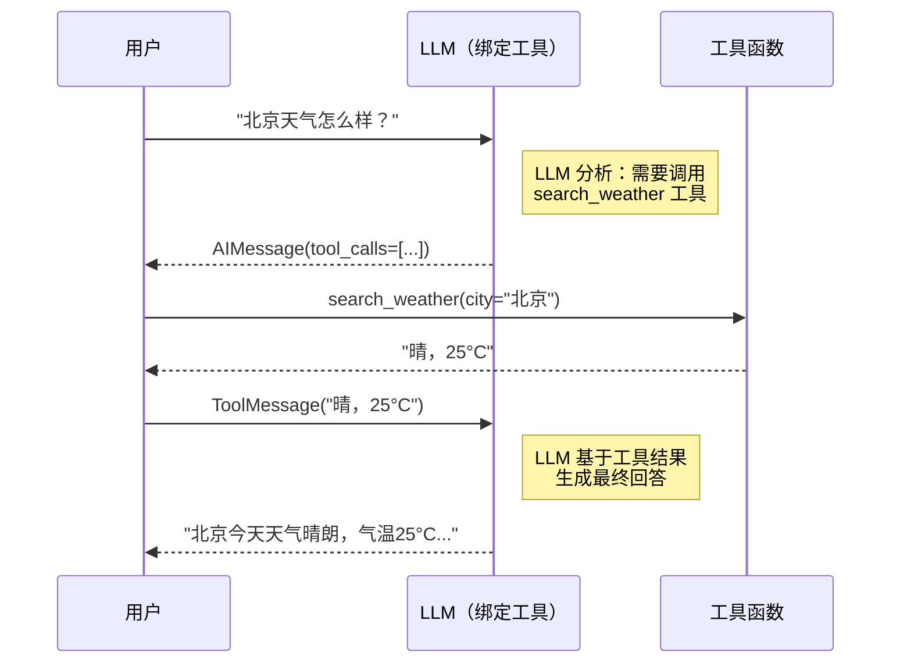
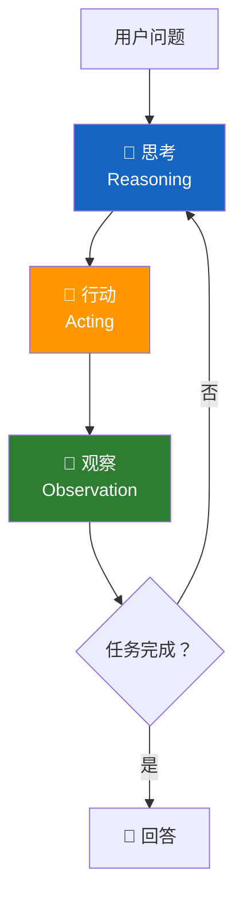
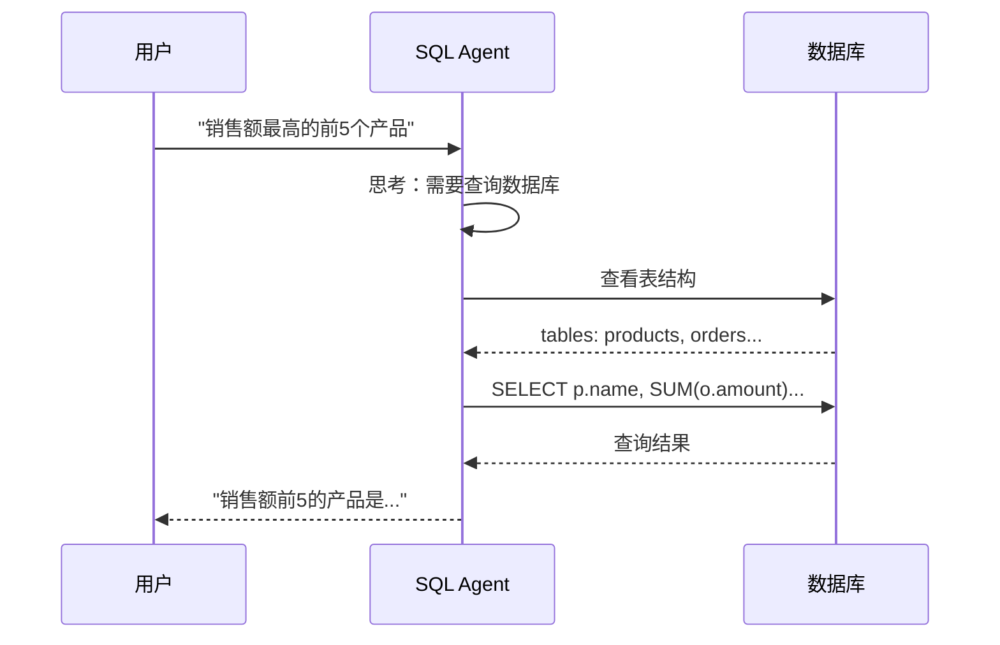
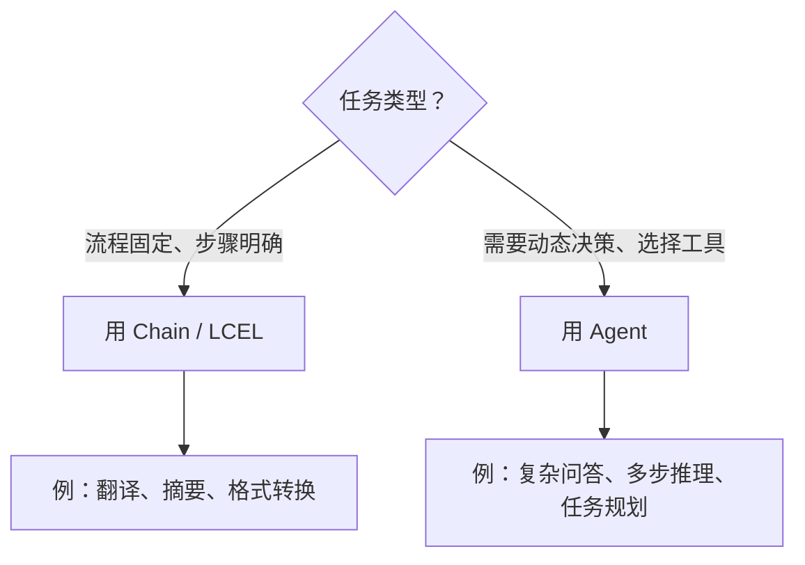

# 🛠️ 第十三章：工具与智能体（Tools & Agents）

## 📌 本章目标

- 理解 Tool 的设计和使用方式
- 掌握 Agent 的工作原理（ReAct 循环）
- 学会构建能使用工具的 AI 智能体

---

## 13.1 什么是 Tool？

**Tool**（工具）是 LLM 可以调用的外部能力 —— 搜索、计算、查数据库、发邮件等。

> 🎯 核心思想：LLM 擅长"思考"和"理解"，但不擅长"精确计算"、"实时查询"等操作。Tool 让 LLM 可以"调用"这些能力，就像人类使用工具一样。

### 类比 🧑‍🔧

| 场景 | 没有 Tool | 有 Tool |
|------|---------|--------|
| "2847 × 9361 = ?" | LLM 可能算错 | 调用计算器工具，精确计算 |
| "今天天气如何？" | LLM 不知道（训练数据过时） | 调用天气 API，获取实时数据 |
| "订单 #12345 的状态？" | LLM 无法访问数据库 | 调用数据库查询工具 |

---

## 13.2 Tool 的定义

### 方式一：@tool 装饰器（最简单）

```python
from langchain_core.tools import tool

@tool
def search_weather(city: str) -> str:
    """查询指定城市的实时天气信息。
    
    Args:
        city: 城市名称，如"北京"、"上海"
    """
    # 模拟 API 调用
    weather_data = {"北京": "晴，25°C", "上海": "多云，22°C"}
    return weather_data.get(city, f"未找到{city}的天气数据")

@tool
def calculate(expression: str) -> str:
    """计算数学表达式。
    
    Args:
        expression: 数学表达式，如 "2 + 3 * 4"
    """
    try:
        return str(eval(expression))  # 注意：生产中不应使用 eval
    except Exception as e:
        return f"计算错误：{e}"

# 查看工具信息
print(search_weather.name)         # "search_weather"
print(search_weather.description)  # "查询指定城市的实时天气信息。"
print(search_weather.args_schema.model_json_schema())
# {"properties": {"city": {"type": "string"}}, "required": ["city"]}
```

> 💡 **关键**：函数的 **docstring** 非常重要！LLM 正是通过阅读描述来决定什么时候使用这个工具。

### 方式二：BaseTool 类（更灵活）

```python
from langchain_core.tools import BaseTool
from pydantic import BaseModel, Field

class SearchInput(BaseModel):
    query: str = Field(description="搜索关键词")
    max_results: int = Field(default=5, description="最大结果数")

class WebSearchTool(BaseTool):
    name: str = "web_search"
    description: str = "搜索互联网获取最新信息"
    args_schema: type[BaseModel] = SearchInput
    
    def _run(self, query: str, max_results: int = 5) -> str:
        """同步执行"""
        return f"搜索'{query}'的前{max_results}个结果：..."
    
    async def _arun(self, query: str, max_results: int = 5) -> str:
        """异步执行"""
        return f"搜索'{query}'的前{max_results}个结果：..."

search_tool = WebSearchTool()
result = search_tool.invoke({"query": "LangChain 最新版本", "max_results": 3})
```

### Tool 的 Runnable 特性

Tool 也是 Runnable，可以参与 LCEL 链：

```python
# Tool 可以直接 invoke
result = search_weather.invoke({"city": "北京"})
print(result)  # "晴，25°C"

# 也可以参与管道
chain = some_logic | search_weather | format_result
```

---

## 13.3 Tool Calling：让模型选择工具

### 绑定工具到模型

```python
from langchain_openai import ChatOpenAI
from langchain_core.messages import HumanMessage

model = ChatOpenAI(model="gpt-4")

# 把工具"告诉"模型
model_with_tools = model.bind_tools([search_weather, calculate])

# 模型会根据问题判断是否需要调用工具
response = model_with_tools.invoke([
    HumanMessage(content="北京今天天气怎么样？")
])

# 检查模型是否决定调用工具
print(response.tool_calls)
# [{'name': 'search_weather', 'args': {'city': '北京'}, 'id': 'call_xxx'}]
print(response.content)
# ""（当模型决定调用工具时，content 通常为空）
```

### Tool Calling 流程图



---

## 13.4 什么是 Agent？

**Agent**（智能体）是一个能够**自主决策**的 AI 系统 —— 它会根据任务：
1. **思考**应该做什么
2. **选择**合适的工具
3. **执行**工具
4. **观察**结果
5. **重复**直到任务完成

> 🎯 Agent 的核心区别：Chain 是"预设流程"，Agent 是"动态决策"。

### 类比 🤖

| 特性 | Chain（链） | Agent（智能体） |
|------|------------|----------------|
| 执行流程 | 固定、预设 | 动态、自主决策 |
| 类比 | 自动售货机（按固定流程出货） | 人类助理（根据情况灵活处理） |
| 适用场景 | 流程明确的任务 | 复杂、开放的任务 |

---

## 13.5 ReAct 模式

大多数 Agent 使用 **ReAct**（Reasoning + Acting）模式：



### ReAct 执行示例

```
用户：帮我查一下北京的天气，并计算华氏温度

🤔 思考：用户想知道北京天气和华氏温度。我需要先查天气，再做温度转换。
🔧 行动：调用 search_weather(city="北京")
👀 观察：返回"晴，25°C"

🤔 思考：北京是 25°C，需要转换为华氏度。公式：F = C × 9/5 + 32
🔧 行动：调用 calculate(expression="25 * 9 / 5 + 32")
👀 观察：返回 "77.0"

🤔 思考：我已经得到了所有信息，可以回答了。
💬 回答：北京今天天气晴朗，温度 25°C（77°F）。
```

---

## 13.6 构建 Agent

### 方式一：使用 create_tool_calling_agent（推荐）

```python
from langchain_openai import ChatOpenAI
from langchain_core.prompts import ChatPromptTemplate, MessagesPlaceholder
from langchain.agents import create_tool_calling_agent, AgentExecutor

# 1. 准备工具
tools = [search_weather, calculate]

# 2. 准备模型
model = ChatOpenAI(model="gpt-4")

# 3. 准备 Prompt
prompt = ChatPromptTemplate.from_messages([
    ("system", "你是一个有用的 AI 助手。尽你所能回答问题，必要时使用提供的工具。"),
    MessagesPlaceholder(variable_name="chat_history", optional=True),
    ("human", "{input}"),
    MessagesPlaceholder(variable_name="agent_scratchpad"),  # Agent 思考过程
])

# 4. 创建 Agent
agent = create_tool_calling_agent(model, tools, prompt)

# 5. 用 AgentExecutor 包装（处理循环、错误等）
agent_executor = AgentExecutor(
    agent=agent,
    tools=tools,
    verbose=True,           # 打印思考过程
    max_iterations=10,      # 最大循环次数（防止死循环）
    handle_parsing_errors=True,  # 自动处理解析错误
)

# 6. 运行！
result = agent_executor.invoke({
    "input": "北京今天天气怎么样？顺便帮我算一下华氏度"
})
print(result["output"])
```

### verbose=True 的输出

```
> Entering new AgentExecutor chain...

Invoking: `search_weather` with `{'city': '北京'}`
晴，25°C

Invoking: `calculate` with `{'expression': '25 * 9 / 5 + 32'}`
77.0

北京今天天气晴朗，温度 25°C（约 77°F），适合外出活动。

> Finished chain.
```

---

## 13.7 Agent Toolkits

LangChain 提供了一些预制的**工具套件**，适合特定场景：

### SQL Agent（数据库查询）

```python
from langchain.agents.agent_toolkits import SQLDatabaseToolkit
from langchain_community.utilities import SQLDatabase

# 连接数据库
db = SQLDatabase.from_uri("sqlite:///company.db")

# 创建 SQL 工具套件
toolkit = SQLDatabaseToolkit(db=db, llm=model)
tools = toolkit.get_tools()

# 创建 SQL Agent
agent_executor = AgentExecutor(
    agent=create_tool_calling_agent(model, tools, prompt),
    tools=tools,
    verbose=True,
)

# 用自然语言查询数据库
result = agent_executor.invoke({"input": "销售额最高的前 5 个产品是什么？"})
```



---

## 13.8 流式 Agent

Agent 也支持流式输出，让用户实时看到思考过程：

```python
# 流式输出 Agent 的执行过程
for event in agent_executor.stream({"input": "北京天气如何？"}):
    if "actions" in event:
        for action in event["actions"]:
            print(f"🔧 调用工具：{action.tool}({action.tool_input})")
    elif "steps" in event:
        for step in event["steps"]:
            print(f"👀 观察：{step.observation}")
    elif "output" in event:
        print(f"💬 最终回答：{event['output']}")
```

---

## 13.9 Agent vs Chain：如何选择？



| 维度 | Chain | Agent |
|------|-------|-------|
| 灵活性 | 低（预设流程） | 高（动态决策） |
| 可预测性 | 高 | 低（取决于 LLM） |
| 成本 | 低（固定调用次数） | 高（可能多次调用） |
| 调试难度 | 简单 | 较难 |
| 适用场景 | 流程明确 | 开放式任务 |

---

## 📌 本章小结

| 要点 | 内容 |
|------|------|
| Tool 是什么 | LLM 可调用的外部能力 |
| @tool 装饰器 | 最简单的工具定义方式 |
| Tool Calling | 让模型决定何时调用什么工具 |
| Agent 是什么 | 能自主决策的 AI 系统（ReAct 循环） |
| AgentExecutor | Agent 的运行环境（处理循环和错误） |
| Toolkits | 预制工具套件（SQL、API 等） |

> ⏭️ 下一章，我们将学习 [回调与可观测性（Callbacks）](./14-callbacks.md) —— 监控和调试 AI 应用。
