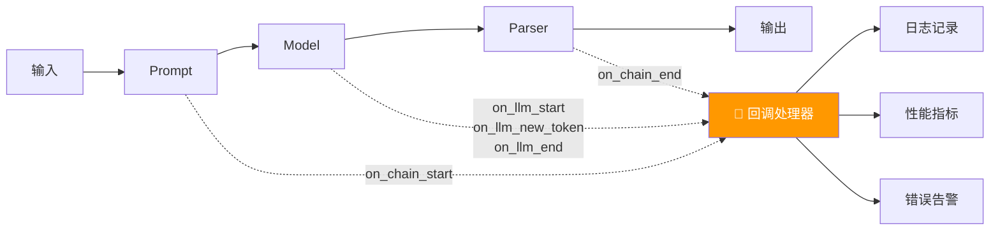
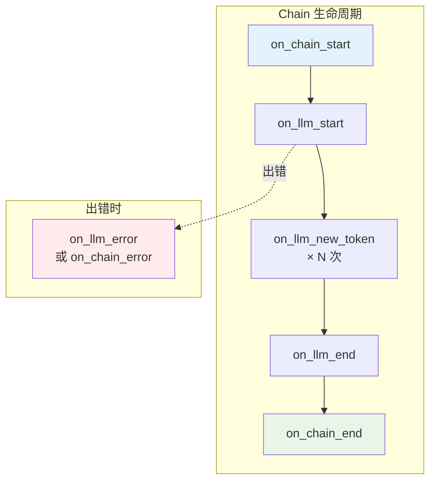

# 📡 第十四章：回调与可观测性（Callbacks）

## 📌 本章目标

- 理解回调系统（Callback）的设计原理
- 掌握自定义回调处理器的编写
- 了解 LangSmith 等可观测性工具

---

## 14.1 为什么需要回调？

当 AI 应用变复杂时，你需要知道：

- 🕐 每一步花了多少时间？
- 💰 消耗了多少 token（花了多少钱）？
- 🐛 哪一步出了错？
- 📊 用户都在问什么问题？

回调系统就是"埋点" —— 在关键节点自动触发你的监控代码。

> 🎯 类比：回调就像工厂的"监控摄像头" —— 产品（数据）在流水线上每经过一个环节，摄像头（回调）就记录一次。



---

## 14.2 BaseCallbackHandler 接口

```python
# 源码路径：libs/core/langchain_core/callbacks/base.py
class BaseCallbackHandler:
    """回调处理器基类 —— 在各种生命周期事件中被调用"""
    
    # ===== LLM 相关 =====
    def on_llm_start(self, serialized, prompts, **kwargs):
        """LLM 开始生成时"""
    
    def on_llm_new_token(self, token, **kwargs):
        """LLM 生成新 token 时（流式）"""
    
    def on_llm_end(self, response, **kwargs):
        """LLM 生成完成时"""
    
    def on_llm_error(self, error, **kwargs):
        """LLM 出错时"""
    
    # ===== Chain 相关 =====
    def on_chain_start(self, serialized, inputs, **kwargs):
        """Chain 开始执行时"""
    
    def on_chain_end(self, outputs, **kwargs):
        """Chain 执行完成时"""
    
    def on_chain_error(self, error, **kwargs):
        """Chain 出错时"""
    
    # ===== Tool 相关 =====
    def on_tool_start(self, serialized, input_str, **kwargs):
        """工具开始执行时"""
    
    def on_tool_end(self, output, **kwargs):
        """工具执行完成时"""
    
    def on_tool_error(self, error, **kwargs):
        """工具出错时"""
    
    # ===== Retriever 相关 =====
    def on_retriever_start(self, serialized, query, **kwargs):
        """检索开始时"""
    
    def on_retriever_end(self, documents, **kwargs):
        """检索完成时"""
```

### 生命周期事件图



---

## 14.3 自定义回调处理器

### 示例一：性能监控

```python
import time
from langchain_core.callbacks import BaseCallbackHandler

class PerformanceCallback(BaseCallbackHandler):
    """监控每一步的执行时间和 token 消耗"""
    
    def __init__(self):
        self.start_times = {}
        self.total_tokens = 0
    
    def on_llm_start(self, serialized, prompts, *, run_id, **kwargs):
        self.start_times[run_id] = time.time()
        print(f"🚀 LLM 开始处理...")
    
    def on_llm_end(self, response, *, run_id, **kwargs):
        elapsed = time.time() - self.start_times.pop(run_id, time.time())
        
        # 提取 token 使用量
        if response.llm_output:
            usage = response.llm_output.get("token_usage", {})
            tokens = usage.get("total_tokens", 0)
            self.total_tokens += tokens
            print(f"✅ LLM 完成：耗时 {elapsed:.2f}s，使用 {tokens} tokens")
    
    def on_llm_error(self, error, *, run_id, **kwargs):
        elapsed = time.time() - self.start_times.pop(run_id, time.time())
        print(f"❌ LLM 出错：{error}（耗时 {elapsed:.2f}s）")
    
    def on_chain_start(self, serialized, inputs, **kwargs):
        name = serialized.get("name", "Unknown")
        print(f"📎 Chain [{name}] 开始")
    
    def on_chain_end(self, outputs, **kwargs):
        print(f"📎 Chain 完成")

# 使用
callback = PerformanceCallback()
result = chain.invoke(
    {"topic": "AI"},
    config={"callbacks": [callback]}
)
print(f"📊 总消耗：{callback.total_tokens} tokens")
```

### 示例二：日志记录

```python
import logging
from langchain_core.callbacks import BaseCallbackHandler

logger = logging.getLogger("langchain_app")

class LoggingCallback(BaseCallbackHandler):
    """将关键事件写入日志"""
    
    def on_llm_start(self, serialized, prompts, **kwargs):
        logger.info(f"LLM调用开始 | 模型: {serialized.get('name', 'unknown')}")
    
    def on_llm_end(self, response, **kwargs):
        logger.info(f"LLM调用完成 | 生成数: {len(response.generations)}")
    
    def on_tool_start(self, serialized, input_str, **kwargs):
        logger.info(f"工具调用 | {serialized.get('name', 'unknown')} | 输入: {input_str}")
    
    def on_tool_error(self, error, **kwargs):
        logger.error(f"工具出错 | {error}")
    
    def on_retriever_end(self, documents, **kwargs):
        logger.info(f"检索完成 | 返回 {len(documents)} 个文档")
```

---

## 14.4 回调的传递方式

### 方式一：运行时传递（推荐）

```python
# 通过 config 参数传递
result = chain.invoke(
    {"topic": "AI"},
    config={"callbacks": [PerformanceCallback(), LoggingCallback()]}
)
```

### 方式二：构造时传递

```python
# 创建模型时就绑定回调
model = ChatOpenAI(
    model="gpt-4",
    callbacks=[PerformanceCallback()],  # 每次调用都会触发
)
```

### 方式三：全局回调

```python
from langchain_core.callbacks import set_handler

# 设置全局回调（所有链都会触发）
set_handler(LoggingCallback())
```

> 💡 **推荐方式一**：运行时传递最灵活，可以按需开启/关闭监控。

---

## 14.5 流式回调

`on_llm_new_token` 是实现流式 UI 的关键：

```python
class StreamingCallback(BaseCallbackHandler):
    """逐 token 输出到终端"""
    
    def on_llm_new_token(self, token: str, **kwargs):
        print(token, end="", flush=True)
    
    def on_llm_end(self, response, **kwargs):
        print()  # 换行

# 使用
model = ChatOpenAI(model="gpt-4", streaming=True)
result = model.invoke(
    [HumanMessage(content="写一首关于春天的诗")],
    config={"callbacks": [StreamingCallback()]}
)
# 逐字输出：春风拂面柳丝长...
```

---

## 14.6 异步回调

对于异步应用，使用 `AsyncCallbackHandler`：

```python
from langchain_core.callbacks import AsyncCallbackHandler

class AsyncPerformanceCallback(AsyncCallbackHandler):
    """异步回调处理器"""
    
    async def on_llm_start(self, serialized, prompts, **kwargs):
        print(f"🚀 LLM 异步开始")
    
    async def on_llm_end(self, response, **kwargs):
        print(f"✅ LLM 异步完成")
        # 可以异步写入数据库、发送通知等
        # await db.insert({"event": "llm_end", ...})

# 在异步代码中使用
result = await chain.ainvoke(
    {"topic": "AI"},
    config={"callbacks": [AsyncPerformanceCallback()]}
)
```

---

## 14.7 LangSmith：生产级可观测性

LangSmith 是 LangChain 团队提供的**可观测性平台**，提供：

- 🔍 **追踪（Tracing）**：查看每次调用的完整执行链路
- 📊 **监控（Monitoring）**：延迟、token 消耗、错误率
- 🧪 **评估（Evaluation）**：自动评估 AI 输出质量
- 🗂️ **数据集（Datasets）**：管理测试数据集

### 接入方式

```bash
# 设置环境变量即可自动集成
export LANGSMITH_API_KEY="ls_xxx"
export LANGSMITH_TRACING="true"
export LANGSMITH_PROJECT="my-ai-app"
```

```python
# 不需要改任何代码！LangChain 会自动把调用信息发送到 LangSmith
chain = prompt | model | parser
result = chain.invoke({"topic": "AI"})
# LangSmith 控制台会显示完整的调用链路
```

### LangSmith 追踪视图示意

```
📋 Chain: translate_chain
├── 📝 Prompt: ChatPromptTemplate
│   ├── 输入: {"topic": "AI", "language": "中文"}
│   └── 输出: [SystemMessage(...), HumanMessage(...)]
│
├── 🤖 LLM: ChatOpenAI (gpt-4)
│   ├── 输入: 2 messages
│   ├── 输出: AIMessage("人工智能是...")
│   ├── ⏱️ 耗时: 1.23s
│   └── 💰 Tokens: prompt=45, completion=120, total=165
│
└── 📤 Parser: StrOutputParser
    ├── 输入: AIMessage(...)
    └── 输出: "人工智能是..."
```

---

## 14.8 实战：构建监控仪表盘

```python
from langchain_core.callbacks import BaseCallbackHandler
from collections import defaultdict
import time

class DashboardCallback(BaseCallbackHandler):
    """简单的监控仪表盘"""
    
    def __init__(self):
        self.metrics = {
            "total_calls": 0,
            "total_tokens": 0,
            "total_cost_usd": 0.0,
            "errors": 0,
            "avg_latency": 0.0,
            "latencies": [],
            "tool_usage": defaultdict(int),
        }
        self._start_times = {}
    
    def on_llm_start(self, serialized, prompts, *, run_id, **kwargs):
        self._start_times[run_id] = time.time()
        self.metrics["total_calls"] += 1
    
    def on_llm_end(self, response, *, run_id, **kwargs):
        latency = time.time() - self._start_times.pop(run_id, time.time())
        self.metrics["latencies"].append(latency)
        self.metrics["avg_latency"] = sum(self.metrics["latencies"]) / len(self.metrics["latencies"])
        
        if response.llm_output:
            usage = response.llm_output.get("token_usage", {})
            tokens = usage.get("total_tokens", 0)
            self.metrics["total_tokens"] += tokens
            # 简化的成本计算（GPT-4 约 $0.03/1K tokens）
            self.metrics["total_cost_usd"] += tokens * 0.03 / 1000
    
    def on_llm_error(self, error, **kwargs):
        self.metrics["errors"] += 1
    
    def on_tool_start(self, serialized, input_str, **kwargs):
        tool_name = serialized.get("name", "unknown")
        self.metrics["tool_usage"][tool_name] += 1
    
    def print_dashboard(self):
        m = self.metrics
        print("=" * 40)
        print("📊 AI 应用监控仪表盘")
        print("=" * 40)
        print(f"📞 总调用次数：{m['total_calls']}")
        print(f"🪙 总 Token 消耗：{m['total_tokens']}")
        print(f"💰 预估费用：${m['total_cost_usd']:.4f}")
        print(f"⏱️ 平均延迟：{m['avg_latency']:.2f}s")
        print(f"❌ 错误次数：{m['errors']}")
        if m['tool_usage']:
            print(f"🔧 工具使用：{dict(m['tool_usage'])}")
        print("=" * 40)

# 使用
dashboard = DashboardCallback()

# 多次调用后查看统计
for topic in ["AI", "Python", "Web"]:
    chain.invoke({"topic": topic}, config={"callbacks": [dashboard]})

dashboard.print_dashboard()
```

---

## 📌 本章小结

| 要点 | 内容 |
|------|------|
| 回调系统 | 在关键节点自动触发的钩子函数 |
| 生命周期 | start → (new_token) → end / error |
| 自定义回调 | 继承 BaseCallbackHandler，重写需要的方法 |
| 传递方式 | 运行时 config（推荐）/ 构造时 / 全局 |
| 流式回调 | on_llm_new_token 实现逐 token 输出 |
| LangSmith | 生产级可观测性平台 |

> ⏭️ 下一章，我们将学习 [记忆与对话历史（Memory）](./15-memory.md) —— 让 AI 拥有"记忆"能力。
