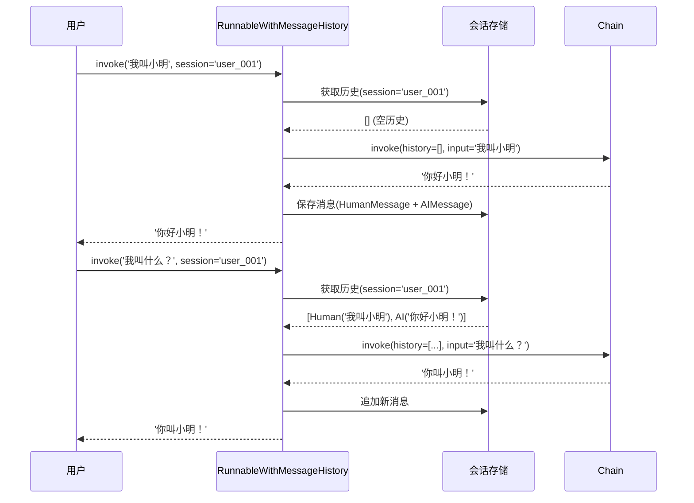
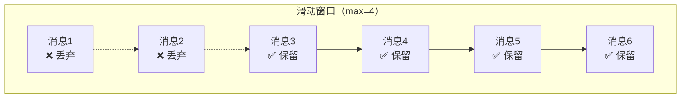
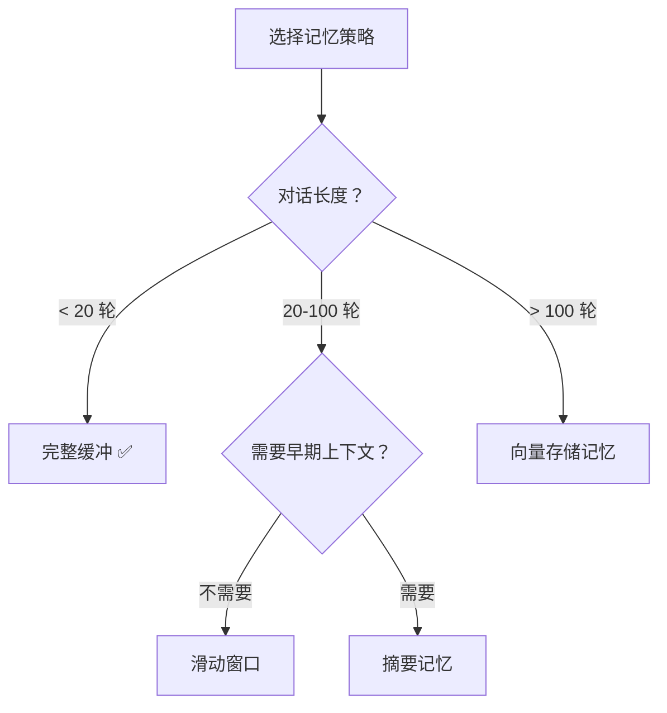
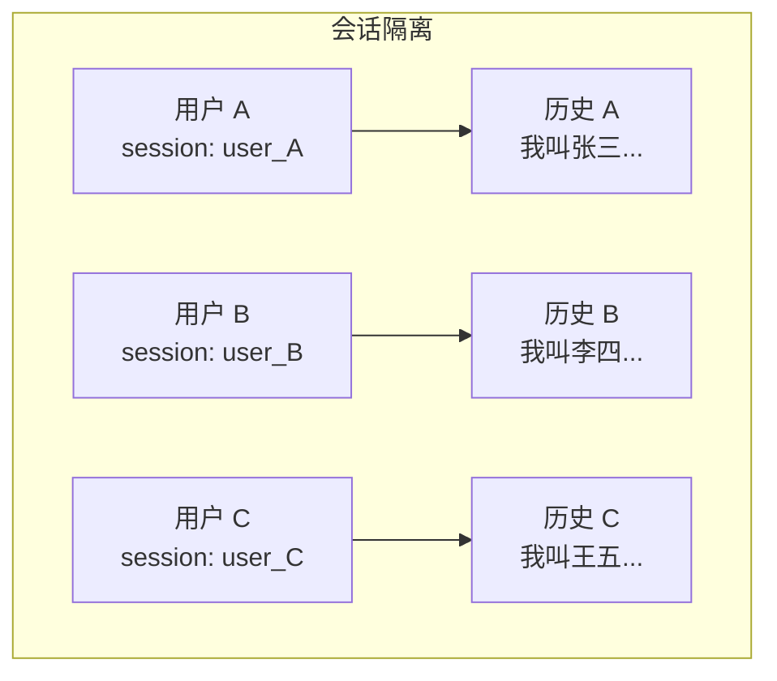

# 🧠 第十五章：记忆与对话历史（Memory）

## 📌 本章目标

- 理解 LLM 为什么"没有记忆"
- 掌握对话历史管理的方法
- 了解不同记忆策略的适用场景

---

## 15.1 LLM 的"金鱼记忆"问题

LLM 本身是**无状态**的 —— 每次调用都是全新的，它不记得之前说过什么。

```python
# 第一次调用
response = model.invoke([HumanMessage(content="我叫小明")])
# "你好小明！很高兴认识你。"

# 第二次调用（LLM 已经忘了）
response = model.invoke([HumanMessage(content="我叫什么名字？")])
# "抱歉，我不知道你的名字。"  ← 忘了！
```

> 🎯 **根本原因**：LLM 就像一个"每次醒来都失忆的人" —— 你每次和它说话，它都认为是第一次见面。

### 解决方案

把历史对话**完整传给**模型：

```python
# 手动传递历史
response = model.invoke([
    HumanMessage(content="我叫小明"),
    AIMessage(content="你好小明！很高兴认识你。"),
    HumanMessage(content="我叫什么名字？"),
])
# "你叫小明！"  ← 记住了！
```

但手动管理历史消息很麻烦 —— 这就是 Memory 模块要解决的问题。

---

## 15.2 ChatMessageHistory：消息存储

```python
# 源码路径：libs/core/langchain_core/chat_history.py
class BaseChatMessageHistory(ABC):
    """对话消息历史的存储接口"""
    
    @abstractmethod
    def add_messages(self, messages: list[BaseMessage]) -> None:
        """添加消息到历史"""
    
    @abstractmethod
    def get_messages(self) -> list[BaseMessage]:
        """获取所有历史消息"""
    
    def clear(self) -> None:
        """清空历史"""
```

### 内存存储

```python
from langchain_core.chat_history import InMemoryChatMessageHistory
from langchain_core.messages import HumanMessage, AIMessage

# 创建内存存储
history = InMemoryChatMessageHistory()

# 添加对话
history.add_messages([
    HumanMessage(content="我叫小明"),
    AIMessage(content="你好小明！"),
])

# 获取历史
messages = history.messages
print(messages)
# [HumanMessage("我叫小明"), AIMessage("你好小明！")]
```

---

## 15.3 在链中使用对话历史

### 使用 RunnableWithMessageHistory

这是 LangChain 推荐的管理对话历史的方式：

```python
from langchain_core.runnables.history import RunnableWithMessageHistory
from langchain_core.chat_history import InMemoryChatMessageHistory
from langchain_core.prompts import ChatPromptTemplate, MessagesPlaceholder
from langchain_openai import ChatOpenAI
from langchain_core.output_parsers import StrOutputParser

# 1. 定义带历史占位符的 Prompt
prompt = ChatPromptTemplate.from_messages([
    ("system", "你是一个友好的 AI 助手"),
    MessagesPlaceholder(variable_name="history"),   # 历史消息插入点
    ("human", "{input}"),
])

# 2. 创建基础链
chain = prompt | ChatOpenAI(model="gpt-4") | StrOutputParser()

# 3. 管理会话历史的存储（用字典模拟多用户）
session_store = {}

def get_session_history(session_id: str) -> InMemoryChatMessageHistory:
    if session_id not in session_store:
        session_store[session_id] = InMemoryChatMessageHistory()
    return session_store[session_id]

# 4. 包装为带历史的链
chain_with_history = RunnableWithMessageHistory(
    chain,
    get_session_history,
    input_messages_key="input",       # 输入字段名
    history_messages_key="history",   # 历史字段名
)

# 5. 使用 —— 相同 session_id 共享历史
config = {"configurable": {"session_id": "user_001"}}

# 第一轮
result1 = chain_with_history.invoke(
    {"input": "我叫小明，我是一个前端开发"},
    config=config,
)
print(result1)  # "你好小明！前端开发很棒..."

# 第二轮（记得之前的对话）
result2 = chain_with_history.invoke(
    {"input": "我叫什么？做什么工作？"},
    config=config,
)
print(result2)  # "你叫小明，你是一个前端开发。"
```

### 流程图



---

## 15.4 记忆策略

随着对话越来越长，历史消息会越来越多，可能超出 LLM 的上下文窗口。不同的记忆策略解决不同的问题：

### 策略一：完整缓冲（Buffer）

```
保留所有消息，最简单但最消耗 token
```

```python
# 默认就是完整缓冲 —— 所有消息都保留
history = InMemoryChatMessageHistory()
```

| 优点 | 缺点 |
|------|------|
| 完整上下文，不丢信息 | 对话一长就会超出上下文限制 |
| 实现最简单 | token 消耗高 |

### 策略二：滑动窗口（Window）

```
只保留最近 N 轮对话
```

```python
from langchain_core.chat_history import InMemoryChatMessageHistory

class WindowedHistory(InMemoryChatMessageHistory):
    """只保留最近 N 轮对话的历史"""
    
    def __init__(self, max_messages: int = 10):
        super().__init__()
        self.max_messages = max_messages
    
    def add_messages(self, messages):
        super().add_messages(messages)
        # 只保留最近的 N 条消息
        if len(self.messages) > self.max_messages:
            self.messages = self.messages[-self.max_messages:]
```



| 优点 | 缺点 |
|------|------|
| Token 消耗可控 | 会丢失早期上下文 |
| 简单有效 | 可能忘记重要的早期信息 |

### 策略三：摘要记忆（Summary）

```
用 AI 把旧消息总结为摘要，保留核心信息的同时减少 token
```

```python
from langchain_core.messages import SystemMessage

def summarize_history(messages, model):
    """把历史消息总结为一段摘要"""
    summary_prompt = f"请将以下对话总结为简短摘要：\n\n"
    for msg in messages:
        role = "用户" if isinstance(msg, HumanMessage) else "AI"
        summary_prompt += f"{role}：{msg.content}\n"
    
    summary = model.invoke([HumanMessage(content=summary_prompt)])
    return SystemMessage(content=f"以下是之前对话的摘要：{summary.content}")
```

| 优点 | 缺点 |
|------|------|
| 保留核心信息 | 可能丢失细节 |
| Token 消耗稳定 | 需要额外的 LLM 调用来做摘要 |

### 策略四：向量存储记忆（Semantic）

```
把历史消息嵌入向量数据库，按语义相关性检索
```

```python
# 概念示意
def get_relevant_history(query, all_messages, vectorstore):
    """根据当前问题，检索最相关的历史消息"""
    # 把所有历史消息存入向量数据库
    # 然后按当前问题做语义搜索
    relevant_msgs = vectorstore.similarity_search(query, k=5)
    return relevant_msgs
```

| 优点 | 缺点 |
|------|------|
| 自动找到最相关的历史 | 实现复杂 |
| 适合超长对话 | 可能遗漏重要但"不相似"的信息 |

### 策略选择指南



---

## 15.5 持久化存储

实际应用中，对话历史需要持久化（不能只存在内存里）：

```python
# 示例：基于文件的简单持久化
import json
from langchain_core.chat_history import BaseChatMessageHistory
from langchain_core.messages import (
    BaseMessage, HumanMessage, AIMessage, 
    messages_to_dict, messages_from_dict,
)

class FileChatMessageHistory(BaseChatMessageHistory):
    """把对话历史保存到 JSON 文件"""
    
    def __init__(self, file_path: str):
        self.file_path = file_path
        self._messages: list[BaseMessage] = []
        self._load()
    
    def _load(self):
        try:
            with open(self.file_path, "r") as f:
                data = json.load(f)
                self._messages = messages_from_dict(data)
        except FileNotFoundError:
            self._messages = []
    
    def _save(self):
        with open(self.file_path, "w") as f:
            json.dump(messages_to_dict(self._messages), f, ensure_ascii=False)
    
    @property
    def messages(self) -> list[BaseMessage]:
        return self._messages
    
    def add_messages(self, messages: list[BaseMessage]) -> None:
        self._messages.extend(messages)
        self._save()
    
    def clear(self) -> None:
        self._messages = []
        self._save()

# 使用
def get_session_history(session_id: str):
    return FileChatMessageHistory(f"./chat_history/{session_id}.json")
```

> 💡 **生产环境**推荐使用数据库存储（如 Redis、PostgreSQL、MongoDB），社区提供了相应的实现。

---

## 15.6 多用户场景

```python
# 通过 session_id 隔离不同用户的对话

# 用户 A
result = chain_with_history.invoke(
    {"input": "我叫张三"},
    config={"configurable": {"session_id": "user_zhangsan"}}
)

# 用户 B
result = chain_with_history.invoke(
    {"input": "我叫李四"},
    config={"configurable": {"session_id": "user_lisi"}}
)

# 用户 A 的后续对话（记得张三）
result = chain_with_history.invoke(
    {"input": "我叫什么？"},
    config={"configurable": {"session_id": "user_zhangsan"}}
)
# "你叫张三！"
```



---

## 📌 本章小结

| 要点 | 内容 |
|------|------|
| 为什么需要 | LLM 是无状态的，需要手动管理对话历史 |
| 核心接口 | BaseChatMessageHistory（存取消息） |
| 推荐方式 | RunnableWithMessageHistory 包装链 |
| 缓冲策略 | 完整保留（简单）/ 滑动窗口（常用）/ 摘要 / 语义 |
| 持久化 | 文件 / Redis / 数据库 |
| 多用户 | 通过 session_id 隔离 |

> ⏭️ 最后一章，我们将学习 [进阶实战与最佳实践](./16-advanced.md) —— 生产环境的实用技巧。
