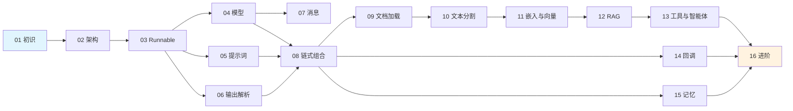

# 🦜🔗 LangChain 由浅入深学习教程

> 本教程基于 [LangChain Python 仓库](https://github.com/langchain-ai/langchain) 源码，由浅入深地讲解 LangChain 的核心概念、架构设计和实战用法。

## 📋 目录

| 章节 | 标题 | 难度 | 简介 |
|------|------|------|------|
| [01](./01-introduction.md) | 🚀 初识 LangChain | ⭐ | LangChain 是什么、解决什么问题、为什么需要它 |
| [02](./02-architecture.md) | 🏗️ 架构全景 | ⭐⭐ | Monorepo 结构、包关系、分层设计思想 |
| [03](./03-core-runnable.md) | 🧩 核心抽象：Runnable | ⭐⭐ | 万物皆 Runnable 的设计哲学与 LCEL 表达式 |
| [04](./04-models.md) | 🤖 语言模型（Models） | ⭐⭐ | LLM 与 ChatModel 的统一接口设计 |
| [05](./05-prompts.md) | 📝 提示词工程（Prompts） | ⭐⭐ | 模板化 Prompt 的设计与实践 |
| [06](./06-output-parsers.md) | 📤 输出解析（Output Parsers） | ⭐⭐ | 把 LLM 的"自由文本"变成结构化数据 |
| [07](./07-messages.md) | 💬 消息系统（Messages） | ⭐⭐ | 多模态消息、Tool Call、流式消息块 |
| [08](./08-chains.md) | 🔗 链式组合（Chains & LCEL） | ⭐⭐⭐ | 用管道符组合 AI 工作流 |
| [09](./09-document-loaders.md) | 📂 文档加载（Document Loaders） | ⭐⭐ | 从各种数据源加载文档 |
| [10](./10-text-splitters.md) | ✂️ 文本分割（Text Splitters） | ⭐⭐ | 智能文本切分策略 |
| [11](./11-embeddings-vectorstores.md) | 🧮 嵌入与向量存储 | ⭐⭐⭐ | 文本向量化与相似度检索 |
| [12](./12-retrievers-rag.md) | 🔍 检索增强生成（RAG） | ⭐⭐⭐ | 从"幻觉"到"有据可依" |
| [13](./13-tools-agents.md) | 🛠️ 工具与智能体（Tools & Agents） | ⭐⭐⭐ | 让 LLM 学会使用工具 |
| [14](./14-callbacks.md) | 📡 回调与可观测性 | ⭐⭐⭐ | 监控、调试、追踪 AI 应用 |
| [15](./15-memory.md) | 🧠 记忆与对话历史 | ⭐⭐⭐ | 让 AI 拥有"记忆" |
| [16](./16-advanced.md) | 🎓 进阶实战与最佳实践 | ⭐⭐⭐⭐ | 缓存、重试、流式、生产部署 |

## 🎯 适合谁？

- ✅ 想系统学习 LLM 应用开发的开发者
- ✅ 有 TypeScript / Python 基础、想了解 LangChain 设计思想的工程师
- ✅ 希望从源码层面理解 LangChain 的进阶开发者

## 📖 学习路线



## 💡 阅读建议

1. **按顺序阅读**：章节之间存在依赖关系，建议从第 01 章开始
2. **动手实践**：每章都有代码示例，建议边读边敲
3. **对照源码**：教程中会标注对应的源码文件路径，建议打开源码对照阅读
4. **善用类比**：教程中大量使用生活化类比，帮助理解抽象概念

## 🔧 环境准备

```bash
# 克隆仓库
git clone https://github.com/langchain-ai/langchain.git
cd langchain

# 安装 uv（快速 Python 包管理器）
pip install uv

# 安装核心包
cd libs/core
uv sync --all-groups

# 安装 OpenAI 集成（示例用）
cd ../partners/openai
uv sync --all-groups
```

> ⚠️ 本教程的代码示例主要使用 Python（因为 LangChain 本身是 Python 项目），但会尽可能提供 TypeScript 风格的伪代码对照说明。

---

*📝 本教程为 AI 辅助生成，基于 LangChain 仓库源码分析。如有错误或建议，欢迎提 Issue 或 PR。*
